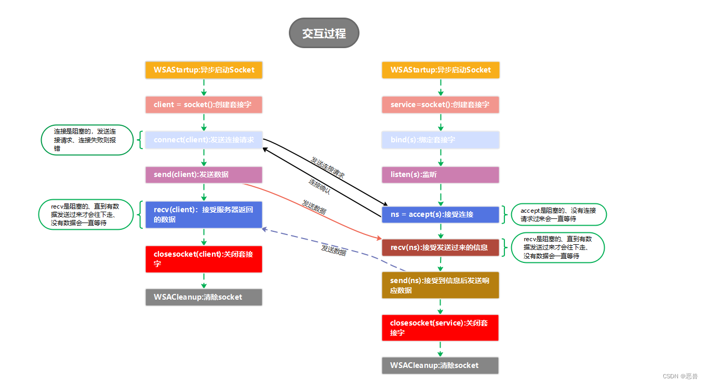

## 在一切开始之前

要进行Socket编程需要导入一些头文件

$\textbf{For Windows}$
```cpp
#include <winsock2.h>
```
如果使用`MSVC`编译器，则再写一行
```cpp
#pragma comment(lib,"ws2_32.lib")
```
如果使用`MinGW`编译器，则在编译选项里加入`-lwsock32`

$\textbf{For Linux}$

```cpp
#include <sys/socket.h>  
#include <netdb.h>
#include <arpa/inet.h>  
#include <unistd.h>
```

## Socket 原理

看图



## 各个函数介绍

### WSAStartup：异步启动套接字命令
 
1、函数原型：
```cpp
int WSAAPI WSAStartup(
  WORD      wVersionRequested,
  LPWSADATA lpWSAData
);
``` 
2、参数：
 
`wVersionRequested`:大部分人用的是2.2、所以我也用的2.2

`lpWSAData`:指向`WSADATA`数据结构的指针，该数据结构将接收`Windows`套接字实现的详细信息
 
3、返回值：
 
返回`0`执行正确
否则失败
 
4、代码范例：
```cpp
WSADATA wsdata;
if (WSAStartup(MAKEWORD(2, 2), &wsdata)){
    std::cout << "init socket failed!" << std::endl;
    WSACleanup();
    return FALSE;
}
```

### socket:创建套接字

1、函数原型：
```cpp
SOCKET socket(int af,int type,int protocl);
```
2、参数：
`af`:第一个参数(af)指定地址族,对于TCP/IP协议的套接字他有以下两个参数：
    `AF_INET`，`PF_INET` IPV4协议
    `PF_INET6` IPV6协议
    其他还有很多协议这里不做介绍
 
`type`:用于设置套接字通信的类型，有流式套接字（`SOCKET_STREAM`）和数据包套接字（`SOCK_DGRAM`）
    `SOCK_STREAM` TCP连接，提供有序化的、可靠的、双向连接的字节流。支持带外数据传输
    `SOCK_DGRAM` UDP连接
 
`protocl`:用于制定某个协议的特定类型，即`type`类型中的某个类型，通常一种协议只有一种类型，该参数可以直接被设置为`0`；如果协议有多种类型，则需要指定协议类型
 
3、返回值
  如果没有错误发生，`socket()`返回一个与建立的套接字相关的描述符。
  否则它返回值`INVALID_SOCKET`，错误码可通过调用`WSAGetLastError()`函数得到
 
 
4、代码范例:
```cpp
//定义一个套接字 作为服务端
SOCKET s_server;
s_server = socket(PF_INET, SOCK_STREAM, 0);
if (s_server == INVALID_SOCKET){
	std::cout << "create socket fail" << std::endl;
	WSACleanup();
	return FALSE;
}
```

### bind:绑定套接字

1、函数原型：
```cpp
    int bind(
          SOCKET   s,
          const sockaddr *addr,
          int      namelen
    );
 
    @ SOCKET   s:要绑定的套接字
    @const sockaddr *addr：指向要分配给绑定套接字的本地地址的sockaddr结构的指针
 
    struct sockaddr {
        ushort  sa_family;
        char    sa_data[14];
    };
 
 
    struct sockaddr_in {
        short   sin_family;             //指定协议家族 ipv4 or ipv6
        u_short sin_port;               //指定端口号
        struct  in_addr sin_addr;       //指定地址 也可以是所有ip 参数为：INADDR_ANY 
        char    sin_zero[8];            //没有特殊意义不用管
    };
 
    struct in_addr {
          union {
                struct {
                      u_char s_b1;
                      u_char s_b2;
                      u_char s_b3;
                      u_char s_b4;
                } S_un_b;
                struct {
                      u_short s_w1;
                      u_short s_w2;
                } S_un_w;
             u_long S_addr;           //ip地址
          } S_un;
     };
 
 
   @int namelen:sockaddr结构的指针的大小
```
 
2、返回值
如果没有错误发生，`bind()`返回`0`。
否则返回值`SOCKET_ERROR`，错误码可通过调用`WSAGetLastError()`函数得到
 
3、代码范例:
```cpp
//填充服务端信息
SOCKADDR_IN server_addr;
server_addr.sin_family = AF_INET;
server_addr.sin_port = htons(8224);
server_addr.sin_addr.S_un.S_addr = inet_addr("127.0.0.1");
 
//数据绑定服务器 s_server为服务端套接字
if(bind(s_server, (SOCKADDR*)&server_addr, sizeof(SOCKADDR)) == SOCKET_ERROR){
		std::cout << "Binding Socket fail!" << std::endl;
		WSACleanup();
		return FALSE;
}
```

### listen:监听

1、函数原型：
```cpp
int PASCAL FAR listen (
    _In_ SOCKET s,
    _In_ int backlog
);
    @SOCKET s：服务端的socket，也就是socket函数创建的
    @int backlog：挂起的连接队列的最大长度,由用户自主选择。但是我们知道我们电脑处理线程的时候用一时间只能处理n个线程、这里也是一样的原理，我们创建的服务器他可能不支持你定义的这个队列长度的用户比如：一个洗手间 只能同时供4个人使用 而这个时候来了8个人 那么其他4个人则需要外面等待。                
    所以一般填写这个参数为SOMAXCONN作用是让系统自动选择最合适的个数不同的系统环境不一样，所以这个合适的数也不一样
```
 
 
2、返回值

成功返回`0`
失败返回`SOCKET_ERROR`具体错误码：`WSAGetLastError()`得到
 
3、代码示例：
```cpp
//监听
if (listen(s_server, 1) == SOCKET_ERROR){
	std::cout << "Listening Socket fail........!" << std::endl;
	WSACleanup();
	return FALSE;
}
```

### accept:接受连接请求

1、函数原型：
```cpp
int WSAAPI connect (
    SOCKET  s,                 
    const struct sockaddr FAR* name,  
    int  namelen   //socket address结构的字节数 
);
 
    @SOCKET  s：发出连接请求的套接字的描述符
    @const struct sockaddr FAR* name：对等方的套接字的地址、就是你创建客户端的套接字时绑定ip和端口号的套接字地址
    @namelen： 套接字类型大小
```
 
2、返回值
如果没有错误发生，`connect()`返回`0`。
否则返回值`SOCKET_ERROR`，错误码可通过调用`WSAGetLastError()`函数得到。
 
3、代码范例：
```cpp
//填充服务端信息
//SOCKADDR_IN server_addr;
//server_addr.sin_family = AF_INET;
//server_addr.sin_addr.S_un.S_addr = inet_addr("127.0.0.1");
//server_addr.sin_port = htons(8224);
//创建套接字
//SOCKET client= socket(AF_INET, SOCK_STREAM, 0);
if (connect(client, (SOCKADDR*)&server_addr, sizeof(SOCKADDR)) == SOCKET_ERROR){
		std::cout << "Error: connect server failed !" << std::endl;
		WSACleanup();
		return -1;
}
```

### send：发送数据

1、函数原型：
```cpp
int WSAAPI send(
    SOCKET  s,    
    const char FAR *  buf,   
    int  len,
    int  flags
);
                    
    @SOCKET  s： 已连接的套接字描述符
    @const char FAR *  buf：指向存有发送数据的缓冲区的指针
    @int  len：缓冲区buf中数据长度
    @int  flags:一般为0,为阻塞发送 即发送不成功会一直阻塞，直到被某个信号终端终止，或者直到发送成功为止。指定MSG_NOSIGNAL，表示当连接被关闭时不会产生SIGPIPE信号指定MSG_DONTWAIT 表示非阻塞发
 
```
2、返回值
 
如果没有错误发生，`send()`返回总共发送的字节数（注意，这可能比len指示的长度小）。
否则它返回`SOCKET_ERROR`，错误码可通过调用`WSAGetLastError()`函数得到。
 
2、代码范例：
```cpp
char temp[1024] = {0};
snprintf(temp, sizeof(temp), "%s", detectInfo);
int sendLen = send(socket, (char*)temp, sizeof(temp), 0);
if (sendLen < 0){
		std::cout << "Error: send info to server failed !" << std::endl;
		return -1;
}
```

### recv：接收数据

1、函数原型：
```cpp
int PASCAL FAR recv (
    SOCKET s,
    writes_bytes_to_(len, return) __out_data_source(NETWORK) char FAR * buf,
    int len,
    int flags
);       
     @SOCKET s：已连接的套接字描述符。
     @char FAR * buf：指向接收输入数据缓冲区的指针
     @int len：buf参数所指缓冲区的长度
     @int flags：一般为0
```
2、返回值
如果没有错误发生，`recv()`返回收到的字节数。
如果连接被关闭，返回`0`。
否则它返回`SOCKET_ERROR`，错误码可通过调用`WSAGetLastError()`函数得到。
 
3、代码示例：
```cpp
char recv_buf[8192] = {0};
int recv_len = recv(socket, recv_buf, sizeof(recv_buf), 0);
if (recv_len < 0) {
		std::cout << "Error: receive info from server failed !" << std::endl;
		return -1;
}
```

### closesocket, WSACleanup:释放socket

使用完后续如果不再使用,**一定**要释放相关资源
```cpp
//关闭套接字 参数：需要关闭的套接字描述符
closesocket(s_server);
//释放DLL资源
WSACleanup();
```
