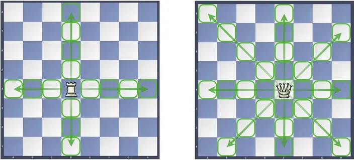

构造题？ 
挺震惊的，我居然想到了怎么构造它

## 题意




- 棋盘上有$1$到$N^2$的值
- $\mathrm{Rook}$可以走前后左右四个方向，$\mathrm{Queen}$可以走八个方向
- $\mathrm{Rook}$和$\mathrm{Queen}$都会挑他们能走到的最小的格子跳过去
- 如果当前他们跳不到任何格子，可以花$1 \mathrm{vun}$跳过去
- 如果棋盘都被跳过了，就结束

给你棋盘大小$N \times N$,要求你构造一个棋盘，使$\mathrm{Rook}$花的钱比$\mathrm{Queen}$少，若果没有，输$-1$。

## 思路

我们手模一些棋盘可以发现

当$N\le2$时一定无解。因为棋盘任意可达。 

当$N = 3$时，我们可以通过构造一组$3 \times 3$棋盘使得$\mathrm{Queen}$最后必须使用$1 \mathrm{vun}$跳过去。比如我构造的是
$$
\begin{matrix}8&7&6 \\ 5&1&2 \\ 4&9&3\end{matrix}
$$
$\mathrm{Queen}$在最后一步必须从$8$跳到$9$而消耗$1 \mathrm{vun}$，而$\mathrm{Rook}$不用

当$N>3$时，我们可以发现只要上下左右中有比当前位置值大$1$的位置，$\mathrm{Rook}$和$\mathrm{Queen}$一定会往那里走，因此我们在$3 \times 3$棋盘基础上，向下向右扩展边长，最后把$\mathrm{Rook}$和$\mathrm{Queen}$全部引导到$3 \times 3$棋盘中$1$的位置即可
即我们可以构造出这样的$4 \times 4$棋盘
$$
\begin{matrix}8+7&7+7&6+7&{\color{blue}{6}} \\ 5+7&1+7&2+7&{\color{blue}{7}} \\ 4+7&9+7&3+7&{\color{red}{5}} \\ {\color{red}{1}}&{\color{red}{2}}&{\color{red}{3}}&{\color{red}{4}}\end{matrix}
$$
也就是
$$
\begin{matrix}15&14&13&{\color{blue}{6}} \\ 12&8&9&{\color{blue}{7}} \\ 11&16&10&{\color{red}{5}} \\ {\color{red}{1}}&{\color{red}{2}}&{\color{red}{3}}&{\color{red}{4}}\end{matrix}
$$


再如$5 \times 5$

$$
\begin{matrix}24&23&22&{\color{blue}{15}}&{\color{red}{1}} \\ 
21&17&18&{\color{blue}{16}}&{\color{red}{2}} \\ 
20&25&19&{\color{red}{14}}&{\color{red}{3}} \\
{\color{red}{10}}&{\color{red}{11}}&{\color{red}{12}}&{\color{red}{13}}&{\color{red}{4}} \\ 
{\color{red}{9}}&{\color{red}{8}}&{\color{red}{7}}&{\color{red}{6}}&{\color{red}{5}}\end{matrix}
$$

其中我们看到蓝色部分需要调换顺序。
这样就完成了构造。

## AC Code
```cpp
#include<bits/stdc++.h>
using namespace std;
typedef long long ll;
inline int read(){
    int x=0,f=1;char c=getchar();
    for(;!isdigit(c);c=getchar())if(c=='-')f=-1;
    for(;isdigit(c);c=getchar())x=(x<<3)+(x<<1)+(c^48);
    return x*f;
}
int a[555][555],n,cnt=0;
int ds[4][2]={{0,1},{-1,0},{1,0},{0,-1}};
void dfs(int x,int y,int d,int maxn){
    if(maxn==3) return ;
    if(y==2&&x==4){
        a[1][4]=++cnt;
        a[2][4]=++cnt;
        return;
    }
    if(y==maxn&&x==maxn){
        a[y][x]=++cnt;
        dfs(x+ds[d+1][0],y+ds[d+1][1],d+1,maxn);
    }else if(y==maxn&&x==1){
        a[y][x]=++cnt;
        if(y-1==3)return;
        a[y-1][x]=++cnt;
        dfs(x+1,y-1,2,maxn-1);
    }else if(y==1&&x==maxn){
        a[y][x]=++cnt;
        if(x-1==3)return;
        a[y][x-1]=++cnt;
        dfs(x-1,y+1,0,maxn-1);
    }else{
        a[y][x]=++cnt;
        dfs(x+ds[d][0],y+ds[d][1],d,maxn);
    }
}
int main(){
    n=read();
    if(n<=2){
        cout<<-1<<endl;
        return 0;
    }
    else if(n>3){if(n&1){
        a[1][n]=++cnt;
        dfs(n,2,0,n);
    }else{
        a[n][1]=++cnt;
        dfs(2,n,2,n);
    }}
    a[3][1]=cnt+4,
    a[3][2]=cnt+9,
    a[3][3]=cnt+3,
    a[2][1]=cnt+5,
    a[2][2]=cnt+1,
    a[2][3]=cnt+2,
    a[1][1]=cnt+8,
    a[1][2]=cnt+7,
    a[1][3]=cnt+6;//关键部分3x3矩阵的构造！
    for(int i = 1;i<=n;i++){
        for(int j = 1;j<=n;j++){
            cout<<a[i][j]<<" ";
        }
        cout<<endl;
    }
}
```
