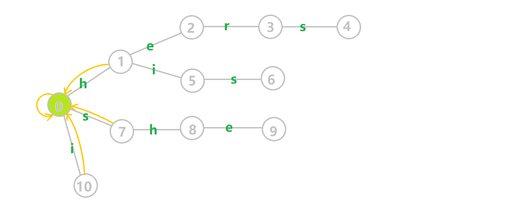
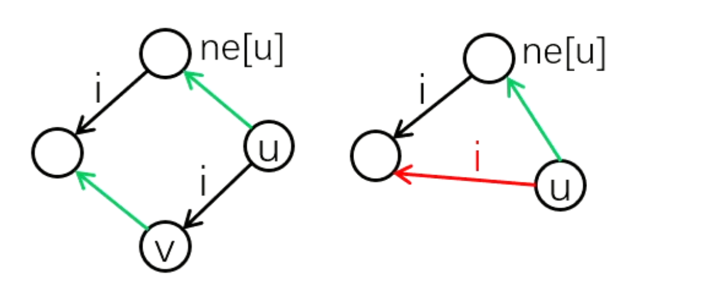

## KMP

`KMP`的出现优化了在字符串中查找子串的过程。使复杂度达到$O(m+n)$

`KMP`算法要求提供主串$s$和模式串$pat$,要求求出模式串在主串中出现的位置。

### next 

算法最重要的部分是求出$next$数组，也有很多说法比如说失配指针(fail)、board数组...大同小异。其意义是到当前位置**之前**最大的相同的前后缀长度。
```cpp
int nex[10005],m/* pat字符串长度 */;
string pat;
void get_nex(){
    nex[0]=0;int pre_len=0/* 最长相同前后缀 */;
    for(int i = 1;i<m;i++){
        while(pre_len && pat[i] !=pat[pre_len])pre_len=nex[pre_len];//利用已求出的nex[]数组更新当前pre_len(跳nex[])
        if(pat[i]==pat[pre_len]/* 找到字符相同的位置 */)nex[i+1]=++pre_len;//更新下个位置的nex[i]
    }
}
```

复杂度$O(m)$


### query

接下来是搜索，遍历主串一遍即可找到


```cpp
string s,pat;
int n,m;
int query(){
    for(int i = 0,j=0/* 用i指向主串，用j指向模式串 */;i<n;i++){
        while(j && s[i]!=pat[j])j = nex[j];//遇到不相等的地方，j就跳nex[];
        if(s[i]==pat[j]) j++;//如果相等，j指针后移
        if(j==m) return i-m+2;/* 返回相同子串开始的地方(这里约定下标开始是1) */
        //若要输出所有的相同字串，记录i-m+2，不要退出，继续遍历即可
    }
    return -1;//找不到，返回
}
```

由于$i$始终递增不减,可知复杂度为$O(n)$

### 模板

```cpp
#include<iostream>
using namespace std;
int nex[100005],pat_len,s_len;
string s,pat;
void build_next(){
    nex[0]=0;int pre_len=0;
    for(int i = 1;i<pat_len;i++){
        while(pre_len && pat[i] !=pat[pre_len])pre_len=nex[pre_len];
        if(pat[i]==pat[pre_len])nex[i+1]=++pre_len;
    }
}
int query(){
    for(int i = 0,j=0;i<s_len;i++){
        while(j && s[i]!=pat[j])j = nex[j];
        if(s[i]==pat[j]) j++;
        if(j==pat_len) return i-pat_len+2;
    }
    return -1;
}
int main(){
    cin>>s>>pat;
    s_len = s.length(),pat_len = pat.length();
    build_next();
    int sta=query();
    if(sta==-1)cout<<"Not found."<<endl;
    else cout<<sta<<endl;
    return 0;
}
```

---


## 自动机

即~~Accepted自动机~~ `Aho–Corasick Automaton`

与`KMP`算法不同的是，`AC自动机`用于多模式串匹配，即一个主串匹配多个模式串。

简单来说，建立一个`AC自动机`有两个步骤：

- 基础的`Trie`结构：将所有的模式串构成一棵`Trie`，构造树边。
- `KMP`的思想：对 Trie 树上所有的结点构造回跳边、转移边，即失配指针。
然后就可以利用它进行多模式匹配了。

### build_Trie

建造一棵`Trie`树

```cpp
int ch[1000005][26],cnt[1000005],idx;
string pat;
void build_Trie(){
    int pos=0;//当前位置信息
    for(int i = 0;pat[i];i++){
        int j = pat[i]-'a';
        if(!ch[pos][j])ch[pos][j]=++idx;
        pos=ch[pos][j];
    }
    ++cnt[pos];//当前节点代表多少字符串
}
```

### build_AC

在`Trie`树的基础上增加回跳边和转移边



- 树边：`Trie`中构建的边 (灰色边)
- 回跳边：指向当前节点的**最长后缀**。构建时，回跳边指向父节点的回跳边所指节点的儿子 (黄色边)
- 转移边：指向当前节点回跳边所指节点的儿子。(黑色边)



```cpp
int ch[1000005][26],nex[1000005]/* 存储回跳边(等同于KMP中的nex[],名字都一样QaQ) */;
void build_AC(){
    queue<int>q;//BFS建立自动机
    for(int i = 0;i<26;i++) if(ch[0][i])q.push(ch[0][i]);//0号节点虚点，特殊处理，把所有的模式串开头加入队列
    while(q.size()){
        int now = q.front();q.pop();
        for(int i = 0 ;i<26;i++){
            int to = ch[now][i];
            if(to)nex[to]=ch[nex[now]][i],q.push(to);//如果有当前儿子存在，就用当前节点回跳边指向节点的儿子更新当前儿子的回跳边
            else ch[now][i]=ch[nex[now]][i];//如果这个方向没有孩子，就用当前节点回跳边的孩子更新当前节点在这个方向的转移边
        }
    }
}
```

### query

查询有多少模式串与主串匹配

扫描主串，依次取出每个字符，并建立两个指针$i,j$

- $i$指针走主串对应的节点，沿着树边或转移边走，保证不回退；
- $j$指针沿着回跳边走，每次从当前节点回到根节点($0$),把以当前节点为止的后缀串全部取出不遗漏

```cpp
int query(){
    int ans=0;
    for(int k = 0,i=0;s[k];k++){
        i=ch[i][s[k]-'a'];//扫描主串
        for(int j = i;j&&~cnt[j]/* ① */;j=nex[j]/* j指针走回跳边，跳回根节点 */){
            ans+=cnt[j],cnt[j]=-1/* 同①处，每次将当前节点代表字符串取出后，清零当前节点计数 */;
        }
    }
    return ans;//返回统计答案
}
```

### 模板

```cpp
#include<iostream>
#include<queue>
using namespace std;
int ch[1000005][26],idx,n;
int nex[1000005],cnt[1000005];
string s,pat;
void build_Trie(){
    int pos=0;
    for(int i = 0;pat[i];i++){
        int j = pat[i]-'a';
        if(!ch[pos][j])ch[pos][j]=++idx;
        pos=ch[pos][j];
    }
    ++cnt[pos];
}
void build_AC(){
    queue<int>q;
    for(int i = 0;i<26;i++) if(ch[0][i])q.push(ch[0][i]);
    while(q.size()){
        int now = q.front();q.pop();
        for(int i = 0 ;i<26;i++){
            int to = ch[now][i];
            if(to)nex[to]=ch[nex[now]][i],q.push(to);
            else ch[now][i]=ch[nex[now]][i];
        }
    }
}
int query(){
    int ans=0;
    for(int k = 0,i=0;s[k];k++){
        i=ch[i][s[k]-'a'];
        for(int j = i;j&&~cnt[j];j=nex[j])ans+=cnt[j],cnt[j]=-1;
    }
    return ans;
}
int main(){
    cin>>n;
    for(int i = 1;i<=n;i++)cin>>pat,build_Trie();
    build_AC();
    cin>>s;
    cout<<query();
    return 0;
}
```
