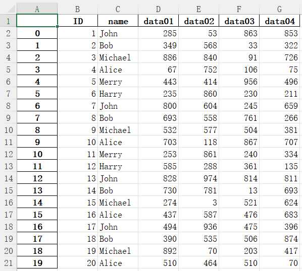
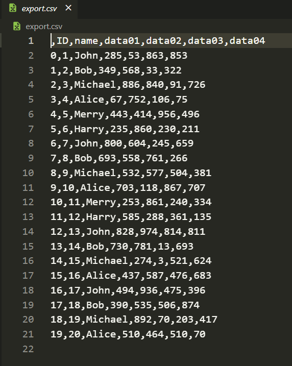

注意：这篇文档只适用于`高考`，完全不是`Pandas`文档。


# DataFrame

提供数据：
|ID|data01|data02|data03|data04|data05|data06|data07|data08|
|:----:|:----:|:----:|:----:|:----:|:----:|:----:|:----:|:----:|
|1|810|841|947|221|114|886|489|380|
|2|903|225|742|722|536|448|224|917|
|3|387|380|853|336|963|384|22|360|
|4|926|487|321|819|427|944|615|178|
|5|24|667|199|842|323|565|556|90|
|6|974|661|443|753|888|293|730|117|

## 读入数据

---

```python
df = pd.read_excel("test.xlsx")
```
```shell
   ID  data01  data02  data03  data04  data05  data06  data07  data08
0   1     813     620     621      63      31     883     860     236
1   2     244      84     767     592     151     110     941     911
2   3     339     776     993     779     699     247     230     239
3   4     952     415     814     617     308     930     625     911
4   5     812     706     378     959      52     700     711      54
5   6     946     208     860      82     977     835     873     268
```

---

把首列设为`index`
```python
df = pd.read_excel("test.xlsx",index_col=0)
```

```shell
    data01  data02  data03  data04  data05  data06  data07  data08
ID
1      813     620     621      63      31     883     860     236
2      244      84     767     592     151     110     941     911
3      339     776     993     779     699     247     230     239
4      952     415     814     617     308     930     625     911
5      812     706     378     959      52     700     711      54
6      946     208     860      82     977     835     873     268
```

## 一些操作

### .T

return `DataFrame`

行列转换

```python
df = pd.read_excel("test.xlsx")
print(df)
print()
print(df.T)
```
```shell
   ID  data01  data02  data03  data04  data05  data06  data07  data08
0   1     813     620     621      63      31     883     860     236
1   2     244      84     767     592     151     110     941     911
2   3     339     776     993     779     699     247     230     239
3   4     952     415     814     617     308     930     625     911
4   5     812     706     378     959      52     700     711      54
5   6     946     208     860      82     977     835     873     268

          0    1    2    3    4    5
ID        1    2    3    4    5    6
data01  813  244  339  952  812  946
data02  620   84  776  415  706  208
data03  621  767  993  814  378  860
data04   63  592  779  617  959   82
data05   31  151  699  308   52  977
data06  883  110  247  930  700  835
data07  860  941  230  625  711  873
data08  236  911  239  911   54  268
```

### .at[index,columns]

#### 读取

return values

```python
print(df.at[5,"ID"])
print(df.at[4,"data06"])
```
```shell
6
700
```
#### 操作

```python
print(df.at[4,"data06"])
df.at[4,"data06"]=114
print(df.at[4,"data06"])
```
```shell
700
114
```

### .columns

return 类似`list`

```python
print(df.columns)
```
```shell
Index(['ID', 'data01', 'data02', 'data03', 'data04', 'data05', 'data06',
       'data07', 'data08'],
      dtype='object')
```

### .index

return 类似`list`

```python
print(df.index)
```
```shell
RangeIndex(start=0, stop=6, step=1)
```

### .pop(columns)

删除某一列
然后将删除的值返回

return `Series`

```python
print(df)
print()
print(df.pop("data05"))
print()
print(df)
```
```shell
   ID  data01  data02  data03  data04  data05  data06  data07  data08
0   1     813     620     621      63      31     883     860     236
1   2     244      84     767     592     151     110     941     911
2   3     339     776     993     779     699     247     230     239
3   4     952     415     814     617     308     930     625     911
4   5     812     706     378     959      52     700     711      54
5   6     946     208     860      82     977     835     873     268

0     31
1    151
2    699
3    308
4     52
5    977
Name: data05, dtype: int64

   ID  data01  data02  data03  data04  data06  data07  data08
0   1     813     620     621      63     883     860     236
1   2     244      84     767     592     110     941     911
2   3     339     776     993     779     247     230     239
3   4     952     415     814     617     930     625     911
4   5     812     706     378     959     700     711      54
5   6     946     208     860      82     835     873     268
```

### .size

获取整个表格数据个数

return `int`

```python
print(df.size)
```
```shell
54
```

### .count(axis=0, numeric_only=False)

return `Series`

更改数据：
|ID|name|data01|data02|data03|data04|data05|data06|data07|data08|
|:----:|:----:|:----:|:----:|:----:|:----:|:----:|:----:|:----:|:----:|
|1|John|215|406|844|901|202|41|352|266|
|2|Bob|308|612|528|546|39|95|146|163|
|3|Michael|608|695|620|707|679|44|255|793|
|4|Alice|466|275|154|519|193|529|338|480|
|5|Merry|867|545|283|475|867|709|118|359|
|6|Harry|975|195|980|997|218|734|546|338|

```python
print(df.count())
print()
print(df.count(axis=1))
print()
print(df.count(numeric_only=True))
```
```shell
ID        6
name      6
data01    6
data02    6
data03    6
data04    6
data05    6
data06    6
data07    6
data08    6
dtype: int64

0    10
1    10
2    10
3    10
4    10
5    10
dtype: int64

ID        6
data01    6
data02    6
data03    6
data04    6
data05    6
data06    6
data07    6
data08    6
dtype: int64
```
### .drop(labels=None, axis=0, index=None, columns=None)

return `DataFrame`

#### 删除列

```python
print(df)
df = df.drop(columns=["data02","data03"])
print(df)
```
或者
```python
print(df)
df = df.drop(["data02","data03"],axis=1)
print(df)
```
```shell
   ID     name  data01  data02  data03  data04  data05  data06  data07  data08
0   1     John      73     479     984     435     550     396      80     660
1   2      Bob      84     785     929     828     742      80     864     257
2   3  Michael      80     444     874     345     141     172     906      61
3   4    Alice     870     380     328     396     564     362     371     599
4   5    Merry     668     997     189     113     410     969     542     332
5   6    Harry     536     732     969     609     852     517     444     346
   ID     name  data01  data04  data05  data06  data07  data08
0   1     John      73     435     550     396      80     660
1   2      Bob      84     828     742      80     864     257
2   3  Michael      80     345     141     172     906      61
3   4    Alice     870     396     564     362     371     599
4   5    Merry     668     113     410     969     542     332
5   6    Harry     536     609     852     517     444     346
```

#### 删除行

```python
print(df)
df = df.drop([2,5])
print(df)
```
或者
```python
print(df)
df = df.drop(index=[2,5])
print(df)
```
```shell
   ID     name  data01  data02  data03  data04  data05  data06  data07  data08
0   1     John      73     479     984     435     550     396      80     660
1   2      Bob      84     785     929     828     742      80     864     257
2   3  Michael      80     444     874     345     141     172     906      61
3   4    Alice     870     380     328     396     564     362     371     599
4   5    Merry     668     997     189     113     410     969     542     332
5   6    Harry     536     732     969     609     852     517     444     346
   ID   name  data01  data02  data03  data04  data05  data06  data07  data08
0   1   John      73     479     984     435     550     396      80     660
1   2    Bob      84     785     929     828     742      80     864     257
3   4  Alice     870     380     328     396     564     362     371     599
4   5  Merry     668     997     189     113     410     969     542     332
```

### .groupby(axis=0, as_index=True, sort=True)

return `DataFrameGroupBy`

更改数据：
|ID|name|data01|data02|data03|data04|
|:----:|:----:|:----:|:----:|:----:|:----:|
|1|John|285|53|863|853|
|2|Bob|349|568|33|322|
|3|Michael|886|840|91|726|
|4|Alice|67|752|106|75|
|5|Merry|443|414|956|496|
|6|Harry|235|860|230|211|
|7|John|800|604|245|659|
|8|Bob|693|558|761|266|
|9|Michael|532|577|504|381|
|10|Alice|703|118|867|707|
|11|Merry|253|861|240|334|
|12|Harry|585|288|361|135|
|13|John|828|974|814|811|
|14|Bob|730|781|13|693|
|15|Michael|274|3|521|624|
|16|Alice|437|587|476|683|
|17|John|494|936|475|396|
|18|Bob|390|535|506|874|
|19|Michael|892|70|203|417|
|20|Alice|510|464|510|70|

```python
print(df)
print()
df_gb = df.groupby("name")
print(df_gb)
print()
print(df_gb.all())
print()
df_gb = df.groupby("name",as_index=False)
print(df_gb.all())
print()
df_gb = df.groupby("name",sort=False)
print(df_gb.all())
```
```shell
    ID     name  data01  data02  data03  data04
0    1     John     285      53     863     853
1    2      Bob     349     568      33     322
2    3  Michael     886     840      91     726
3    4    Alice      67     752     106      75
4    5    Merry     443     414     956     496
5    6    Harry     235     860     230     211
6    7     John     800     604     245     659
7    8      Bob     693     558     761     266
8    9  Michael     532     577     504     381
9   10    Alice     703     118     867     707
10  11    Merry     253     861     240     334
11  12    Harry     585     288     361     135
12  13     John     828     974     814     811
13  14      Bob     730     781      13     693
14  15  Michael     274       3     521     624
15  16    Alice     437     587     476     683
16  17     John     494     936     475     396
17  18      Bob     390     535     506     874
18  19  Michael     892      70     203     417
19  20    Alice     510     464     510      70

<pandas.core.groupby.generic.DataFrameGroupBy object at 0x000001ECA31A79D0>

           ID  data01  data02  data03  data04
name
Alice    True    True    True    True    True
Bob      True    True    True    True    True
Harry    True    True    True    True    True
John     True    True    True    True    True
Merry    True    True    True    True    True
Michael  True    True    True    True    True

      name    ID  data01  data02  data03  data04
0    Alice  True    True    True    True    True
1      Bob  True    True    True    True    True
2    Harry  True    True    True    True    True
3     John  True    True    True    True    True
4    Merry  True    True    True    True    True
5  Michael  True    True    True    True    True

           ID  data01  data02  data03  data04
name
John     True    True    True    True    True
Bob      True    True    True    True    True
Michael  True    True    True    True    True
Alice    True    True    True    True    True
Merry    True    True    True    True    True
Harry    True    True    True    True    True
```

#### .count()

返回每个群组内项目的计数

return `DataFrame`

```python
df_gb = df.groupby("name")
print(df_gb.count())
```
```shell
         ID  data01  data02  data03  data04
name
Alice     4       4       4       4       4
Bob       4       4       4       4       4
Harry     2       2       2       2       2
John      4       4       4       4       4
Merry     2       2       2       2       2
Michael   4       4       4       4       4
```

#### .max(numeric_only=False)

计算每个群组中的最大值

注意： `numeric_only=False`在教科书版本中默认为`True`，这个选项若为`False`会使非整形和浮点型条目报错！！！
以下`.min()`、`.mean()`、`.sum()`同理.

return `DataFrame`
```python
df_gb = df.groupby("name")
print(df_gb.max())
```
```shell
         ID  data01  data02  data03  data04
name
Alice    20     703     752     867     707
Bob      18     730     781     761     874
Harry    12     585     860     361     211
John     17     828     974     863     853
Merry    11     443     861     956     496
Michael  19     892     840     521     726
```


#### .min(numeric_only=False)

计算每个群组中的最小值

return `DataFrame`
```python
df_gb = df.groupby("name")
print(df_gb.min())
```
```shell
         ID  data01  data02  data03  data04
name
Alice     4      67     118     106      70
Bob       2     349     535      13     266
Harry     6     235     288     230     135
John      1     285      53     245     396
Merry     5     253     414     240     334
Michael   3     274       3      91     381
```

#### .mean(numeric_only=False)

计算每个群组中数据的平均数

return `DataFrame`

```python
df_gb = df.groupby("name")
print(df_gb.mean())
```
```shell
           ID  data01  data02  data03  data04
name
Alice    12.5  429.25  480.25  489.75  383.75
Bob      10.5  540.50  610.50  328.25  538.75
Harry     9.0  410.00  574.00  295.50  173.00
John      9.5  601.75  641.75  599.25  679.75
Merry     8.0  348.00  637.50  598.00  415.00
Michael  11.5  646.00  372.50  329.75  537.00
```

#### .sum(numeric_only=False)

给每个群组中的数据求和

return `DataFrame`

```python
df_gb = df.groupby("name")
print(df_gb.sum())
```
```shell
         ID  data01  data02  data03  data04
name
Alice    50    1717    1921    1959    1535
Bob      42    2162    2442    1313    2155
Harry    18     820    1148     591     346
John     38    2407    2567    2397    2719
Merry    16     696    1275    1196     830
Michael  46    2584    1490    1319    2148
```

#### .head(n=5)

返回每个群组中前`n`项

return `DataFrame`

```python
df_gb = df.groupby("name")
print(df_gb.head(1))
print()
print(df_gb.head(n=1))
print()
print(df_gb.head(2))
print()
```
```shell
   ID     name  data01  data02  data03  data04
0   1     John     285      53     863     853
1   2      Bob     349     568      33     322
2   3  Michael     886     840      91     726
3   4    Alice      67     752     106      75
4   5    Merry     443     414     956     496
5   6    Harry     235     860     230     211

   ID     name  data01  data02  data03  data04 
0   1     John     285      53     863     853 
1   2      Bob     349     568      33     322 
2   3  Michael     886     840      91     726 
3   4    Alice      67     752     106      75 
4   5    Merry     443     414     956     496 
5   6    Harry     235     860     230     211 

    ID     name  data01  data02  data03  data04
0    1     John     285      53     863     853
1    2      Bob     349     568      33     322
2    3  Michael     886     840      91     726
3    4    Alice      67     752     106      75
4    5    Merry     443     414     956     496
5    6    Harry     235     860     230     211
6    7     John     800     604     245     659
7    8      Bob     693     558     761     266
8    9  Michael     532     577     504     381
9   10    Alice     703     118     867     707
10  11    Merry     253     861     240     334
11  12    Harry     585     288     361     135
```

#### .tail(n=5)

返回每个群组中后`n`项

return `DataFrame`

```python
df_gb = df.groupby("name")
print(df_gb.tail(1))
print()
print(df_gb.tail(n=1))
print()
print(df_gb.tail(2))
print()
```
```shell
    ID     name  data01  data02  data03  data04
10  11    Merry     253     861     240     334
11  12    Harry     585     288     361     135
16  17     John     494     936     475     396
17  18      Bob     390     535     506     874
18  19  Michael     892      70     203     417
19  20    Alice     510     464     510      70

    ID     name  data01  data02  data03  data04
10  11    Merry     253     861     240     334
11  12    Harry     585     288     361     135
16  17     John     494     936     475     396
17  18      Bob     390     535     506     874
18  19  Michael     892      70     203     417
19  20    Alice     510     464     510      70

    ID     name  data01  data02  data03  data04
4    5    Merry     443     414     956     496
5    6    Harry     235     860     230     211
10  11    Merry     253     861     240     334
11  12    Harry     585     288     361     135
12  13     John     828     974     814     811
13  14      Bob     730     781      13     693
14  15  Michael     274       3     521     624
15  16    Alice     437     587     476     683
16  17     John     494     936     475     396
17  18      Bob     390     535     506     874
18  19  Michael     892      70     203     417
19  20    Alice     510     464     510      70
```

### .head(n=5)

返回`DataFrame`的前`n`项

return `DataFrame`

```python
print(df.head())
print()
print(df.head(3))
print()
print(df.head(n=6))
print()
```
```shell
   ID     name  data01  data02  data03  data04
0   1     John     285      53     863     853
1   2      Bob     349     568      33     322
2   3  Michael     886     840      91     726
3   4    Alice      67     752     106      75
4   5    Merry     443     414     956     496

   ID     name  data01  data02  data03  data04
0   1     John     285      53     863     853
1   2      Bob     349     568      33     322
2   3  Michael     886     840      91     726

   ID     name  data01  data02  data03  data04
0   1     John     285      53     863     853
1   2      Bob     349     568      33     322
2   3  Michael     886     840      91     726
3   4    Alice      67     752     106      75
4   5    Merry     443     414     956     496
5   6    Harry     235     860     230     211
```

### .tail(n=5)

返回`DataFrame`的后`n`项

return `DataFrame`

```python
print(df.tail())
print()
print(df.tail(3))
print()
```
```shell
    ID     name  data01  data02  data03  data04
15  16    Alice     437     587     476     683
16  17     John     494     936     475     396
17  18      Bob     390     535     506     874
18  19  Michael     892      70     203     417
19  20    Alice     510     464     510      70

    ID     name  data01  data02  data03  data04
17  18      Bob     390     535     506     874
18  19  Michael     892      70     203     417
19  20    Alice     510     464     510      70
```

### .max(axis=0, numeric_only=False)

返回行或列的最大值

return `Series`

```python
print(df.max())
```
```shell
ID             20
name      Michael
data01        892
data02        974
data03        956
data04        874
dtype: object
```

对于`axis=True`我们发现

```python
print(df.max(axis=1))
```
```shell
Traceback (most recent call last):
  File "e:\pyCode\pandas\test.py", line 14, in <module>
    print(df.max(axis=1))
  File "C:\Users\pandas_test\AppData\Local\Programs\Python\Python310\lib\site-packages\pandas\core\generic.py", line 11646, in max
    return NDFrame.max(self, axis, skipna, numeric_only, **kwargs)
  File "C:\Users\pandas_test\AppData\Local\Programs\Python\Python310\lib\site-packages\pandas\core\generic.py", line 11185, in max
    return self._stat_function(
  File "C:\Users\pandas_test\AppData\Local\Programs\Python\Python310\lib\site-packages\pandas\core\generic.py", line 11158, in _stat_function  
    return self._reduce(
  File "C:\Users\pandas_test\AppData\Local\Programs\Python\Python310\lib\site-packages\pandas\core\frame.py", line 10524, in _reduce
    res = df._mgr.reduce(blk_func)
  File "C:\Users\pandas_test\AppData\Local\Programs\Python\Python310\lib\site-packages\pandas\core\internals\managers.py", line 1534, in reduce
    nbs = blk.reduce(func)
  File "C:\Users\pandas_test\AppData\Local\Programs\Python\Python310\lib\site-packages\pandas\core\internals\blocks.py", line 339, in reduce   
    result = func(self.values)
  File "C:\Users\pandas_test\AppData\Local\Programs\Python\Python310\lib\site-packages\pandas\core\frame.py", line 10487, in blk_func
    return op(values, axis=axis, skipna=skipna, **kwds)
  File "C:\Users\pandas_test\AppData\Local\Programs\Python\Python310\lib\site-packages\pandas\core\nanops.py", line 158, in f
    result = alt(values, axis=axis, skipna=skipna, **kwds)
  File "C:\Users\pandas_test\AppData\Local\Programs\Python\Python310\lib\site-packages\pandas\core\nanops.py", line 421, in new_func
    result = func(values, axis=axis, skipna=skipna, mask=mask, **kwargs)
  File "C:\Users\pandas_test\AppData\Local\Programs\Python\Python310\lib\site-packages\pandas\core\nanops.py", line 1094, in reduction
    result = getattr(values, meth)(axis)
  File "C:\Users\pandas_test\AppData\Local\Programs\Python\Python310\lib\site-packages\numpy\core\_methods.py", line 41, in _amax
    return umr_maximum(a, axis, None, out, keepdims, initial, where)
TypeError: '>=' not supported between instances of 'int' and 'str'
```

这就是上面说的`numeric_only=False`造成的
我们可以看到错误为
```shell
TypeError: '>=' not supported between instances of 'int' and 'str'
```
但考试笔试请忽略

正确的应该是
```python
print(df.max(axis=1, numeric_only=True))
```
这样会默认省掉`name`这一列

```shell
0     863
1     568
2     886
3     752
4     956
5     860
6     800
7     761
8     577
9     867
10    861
11    585
12    974
13    781
14    624
15    683
16    936
17    874
18    892
19    510
dtype: int64
```

### .min(axis=0, numeric_only=False)

返回行或列的最小值

return `Series`

```python
print(df.min())
print()
print(df.min(axis=1,numeric_only=True))
print()
```
```shell
ID            1
name      Alice
data01       67
data02        3
data03       13
data04       70
dtype: object  

0      1
1      2
2      3
3      4
4      5
5      6
6      7
7      8
8      9
9     10
10    11
11    12
12    13
13    13
14     3
15    16
16    17
17    18
18    19
19    20
dtype: int64
```

### .mean(axis=0, numeric_only=False)

返回行或列的平均值

return `Series`

```python
print(df.mean(numeric_only=True))
print()
print(df.mean(axis=1,numeric_only=True))
print()
```
```shell
ID         10.50
data01    519.30
data02    542.15
data03    438.75
data04    486.65
dtype: float64

0     411.0
1     254.8
2     509.2
3     200.8
4     462.8
5     308.4
6     463.0
7     457.2
8     400.6
9     481.0
10    339.8
11    276.2
12    688.0
13    446.2
14    287.4
15    439.8
16    463.6
17    464.6
18    320.2
19    314.8
dtype: float64
```

### .sum(axis=0, numeric_only=False)

对行或列求和

return `Series`

```python
print(df.sum())
print()
print(df.sum(numeric_only=True))
print()
print(df.sum(axis=1,numeric_only=True))
print()
```
```shell
ID                                                      210
name      JohnBobMichaelAliceMerryHarryJohnBobMichaelAli...
data01                                                10386
data02                                                10843
data03                                                 8775
data04                                                 9733
dtype: object

ID          210
data01    10386
data02    10843
data03     8775
data04     9733
dtype: int64   

0     2055     
1     1274     
2     2546     
3     1004     
4     2314     
5     1542
6     2315
7     2286
8     2003
9     2405
10    1699
11    1381
12    3440
13    2231
14    1437
15    2199
16    2318
17    2323
18    1601
19    1574
dtype: int64
```

### .to_excel() .to_csv() ...

导出到`excel`,`csv`等等

return `.xlsx`, `.xls`, `.csv`...

```python
df.to_excel("export.xlsx")
df.to_csv("export.csv")
```


