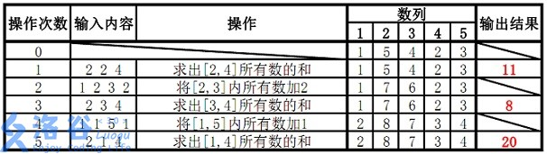

## 题目描述

如题，已知一个数列，你需要进行下面两种操作：
1. 将某区间每一个数加上 $k$。
2. 求出某区间每一个数的和。
   
<!-- more -->

## 输入格式

第一行包含两个整数 $n, m$，分别表示该数列数字的个数和操作的总个数。

第二行包含 $n$ 个用空格分隔的整数，其中第 $i$ 个数字表示数列第 $i$ 项的初始值。

接下来 $m$ 行每行包含 $3$ 或 $4$ 个整数，表示一个操作，具体如下：

1. `1 x y k`：将区间 $[x, y]$ 内每个数加上 $k$。
2. `2 x y`：输出区间 $[x, y]$ 内每个数的和。

## 输出格式

输出包含若干行整数，即为所有操作 2 的结果。

## 样例 #1

### 样例输入 #1

```
5 5
1 5 4 2 3
2 2 4
1 2 3 2
2 3 4
1 1 5 1
2 1 4
```

### 样例输出 #1

```
11
8
20
```

## 提示

对于 $30\%$ 的数据：$n \le 8$，$m \le 10$。  
对于 $70\%$ 的数据：$n \le {10}^3$，$m \le {10}^4$。  
对于 $100\%$ 的数据：$1 \le n, m \le {10}^5$。

保证任意时刻数列中任意元素的和在 $[-2^{63}, 2^{63})$ 内。

**【样例解释】**



<div class="tabs is-toggle"><ul>
<li class="is-active"><a onclick="onTabClick(event)">
<span>算法分析</span>
</a></li>
<li><a onclick="onTabClick(event)">
<span>模板-区间和</span>
</a></li>
<li><a onclick="onTabClick(event)">
<span>模板-区间乘余mod</span>
</a></li>
</ul></div>

<div id="算法分析" class="tab-content" style="display: block;">

### 建树
```cpp
void build(int pos,int l,int r){
    tree[pos].l=l,tree[pos].r=r;
    if(l==r) {tree[pos].val=read()%mod;return;}
    int mid=(l+r)>>1;
    build(pos<<1,l,mid);
    build(pos<<1|1,mid+1,r);
    pushup(pos);
}
```
---
### 上放
```cpp
void pushup(int pos){
    tree[pos].val=(tree[pos<<1].val+tree[pos<<1|1].val)%mod;
}
```
### 下放
#### 和
```cpp
void pushdown(int pos){
    if(tree[pos].lazy){
        tree[pos<<1].val+=tree[pos].lazy*(tree[pos<<1].r-tree[pos<<1].l+1);
        tree[pos<<1|1].val+=tree[pos].lazy*(tree[pos<<1|1].r-tree[pos<<1|1].l+1);
        tree[pos<<1].lazy+=tree[pos].lazy;
        tree[pos<<1|1].lazy+=tree[pos].lazy;
        tree[pos].lazy=0;
    }
    return;
}
```

#### 和与积
```cpp
void pushdown(int pos){
    if(tree[pos].lazy||tree[pos].mu!=1){
        tree[pos<<1].mu=(tree[pos<<1].mu*tree[pos].mu)%mod;
		tree[pos<<1|1].mu=(tree[pos<<1|1].mu*tree[pos].mu)%mod;
		tree[pos<<1].lazy=(tree[pos<<1].lazy*tree[pos].mu)%mod;
		tree[pos<<1|1].lazy=(tree[pos<<1|1].lazy*tree[pos].mu)%mod;
		tree[pos<<1].val=(tree[pos<<1].val*tree[pos].mu)%mod;
		tree[pos<<1|1].val=(tree[pos<<1|1].val*tree[pos].mu)%mod;
		tree[pos].mu=1;
		tree[pos<<1].val=(tree[pos<<1].val+tree[pos].lazy*(tree[pos<<1].r-tree[pos<<1].l+1))%mod;
		tree[pos<<1|1].val=(tree[pos<<1|1].val+tree[pos].lazy*(tree[pos<<1|1].r-tree[pos<<1|1].l+1))%mod;
		tree[pos<<1].lazy=(tree[pos].lazy+tree[pos<<1].lazy)%mod;
		tree[pos<<1|1].lazy=(tree[pos].lazy+tree[pos<<1|1].lazy)%mod;
		tree[pos].lazy=0;
    }
}
```
---

### 更新

#### 单点更新（加）
```cpp
void updatepoint(int pos,int x,int data){
    if(tree[pos].l==x&&tree[pos].r==x) tree[pos].val+=data;
    pushdown(pos);
    int mid=(tree[pos].l+tree[pos].r)>>1;
    if(mid<x) updatepoint(pos<<1|1,x,data);
    else updatepoint(pos<<1,x,data);
    pushup(pos);
}
```
#### 区间更新
##### 和
```cpp
void updatarea_add(int pos,int x,int y,int data){
    int l = tree[pos].l,r=tree[pos].r;
    int len=r-l+1,mid=(l+r)>>1;
    if(l>=x&&r<=y){
        tree[pos].val+=len*data;
        tree[pos].lazy+=data;
        return;
    }
    pushdown(pos);
    if(mid>=x) updatarea_add(pos<<1,x,y,data);
    if(mid<y) updatarea_add(pos<<1|1,x,y,data);
    pushup(pos);
}
```
##### 积
```cpp
void updatearea_acu(int pos,int x,int y,int data){
    int l = tree[pos].l,r=tree[pos].r;
    int mid=(l+r)>>1;
    if(l>=x&&r<=y){
        tree[pos].val=(tree[pos].val*data)%mod;
        tree[pos].lazy=(tree[pos].lazy*data)%mod;
        tree[pos].mu=(tree[pos].mu*data)%mod;
        return;
    }
    pushdown(pos);
    if(mid>=x) updatearea_acu(pos<<1,x,y,data);
    if(mid<y) updatearea_acu(pos<<1|1,x,y,data);
    pushup(pos);
}
```
---
### 查询
#### 单点查询
```cpp
int querypoint(int pos,int x){
    if(tree[pos].l==x&&tree[pos].r==x) return tree[pos].val;
    pushdown(pos);
    int mid=(tree[pos].l+tree[pos].r)>>1;
    if(mid<x) return querypoint(pos<<1|1,x);
    else return querypoint(pos<<1,x);
}
```
#### 区间和查询
```cpp
long long queryarea(int x,int y,int pos){
    int l = tree[pos].l,r=tree[pos].r;
    if(x<=l&&r<=y) return tree[pos].val;
    pushdown(pos);
    int mid=(l+r)>>1;
    long long ans=0;
    if(mid>=x) ans=(ans+queryarea(x,y,pos<<1))//%mod;<--按需
    if(mid<y) ans=(ans+queryarea(x,y,pos<<1|1))//%mod;<--按需
    return ans;
}
```

</div>

<div id="模板-区间和" class="tab-content">

### $Model$
```cpp
#include<iostream>
using namespace std;
int a[100005];
struct node{
    int l;
    int r;
    long long val;
    int lazy;
}tree[6000005];
inline long long read(){
	long long x=0,f=1;char c=getchar();
	for(;!isdigit(c);c=getchar())if(c=='-')f=-1;
	for(;isdigit(c);c=getchar())x=(x<<3)+(x<<1)+(c^48);
	return x*f;
}
void pushup(int pos){
    tree[pos].val=tree[pos<<1].val+tree[pos<<1|1].val;
}
void pushdown(int pos){
    if(tree[pos].lazy){
        tree[pos<<1].val+=tree[pos].lazy*(tree[pos<<1].r-tree[pos<<1].l+1);
        tree[pos<<1|1].val+=tree[pos].lazy*(tree[pos<<1|1].r-tree[pos<<1|1].l+1);
        tree[pos<<1].lazy+=tree[pos].lazy;
        tree[pos<<1|1].lazy+=tree[pos].lazy;
        tree[pos].lazy=0;
    }
    return;
}
void updata(int pos,int l,int r,int data){
    if(tree[pos].l>=l&&tree[pos].r<=r){
        tree[pos].val+=((tree[pos].r-tree[pos].l+1)*data);
        tree[pos].lazy+=data;
        return;
    }
    pushdown(pos);
    int mid=(tree[pos].l+tree[pos].r)>>1;
    if(mid>=l) updata(pos<<1,l,r,data);
    if(mid<r) updata(pos<<1|1,l,r,data);
    pushup(pos);
}
long long query(int x,int y,int pos){
    pushdown(pos);
    if(x<=tree[pos].l&&y>=tree[pos].r) return tree[pos].val;
    int mid=(tree[pos].l+tree[pos].r)>>1;
    long long ans=0;
    if(mid>=x)ans+=query(x,y,pos<<1);
    if(mid<y)ans+=query(x,y,pos<<1|1);
    return ans;
}
void build(int pos,int l,int r){
    tree[pos].l=l,tree[pos].r=r;
    if(l==r){
        tree[pos].val=read();
        return;
    }
    int mid=(l+r)>>1;
    build(pos<<1,l,mid);
    build(pos<<1|1,mid+1,r);
    pushup(pos);
    return;
}
int main(){
    int n,m,opt,x,y,k;
    cin>>n>>m;
    build(1,1,n);
    for(int i = 1;i<=m;i++){
        cin>>opt;
        if(opt==1){
            cin>>x>>y>>k;
            updata(1,x,y,k);
        }else{
            cin>>x>>y;
            cout<<query(x,y,1)<<endl;
        }
    }
}
```

</div>

<div id="模板-区间乘余mod" class="tab-content">

### $Model$
```cpp
#include<iostream>
using namespace std;
int mod;
int a[100005];
struct node{
    int l;
    int r;
    long long val;
    long long lazy;
    long long mu=1;
}tree[400005];
inline long long read(){
	long long x=0,f=1;char c=getchar();
	for(;!isdigit(c);c=getchar())if(c=='-')f=-1;
	for(;isdigit(c);c=getchar())x=(x<<3)+(x<<1)+(c^48);
	return x*f;
}
void pushup(int pos){
    tree[pos].val=(tree[pos<<1].val+tree[pos<<1|1].val)%mod;
}
void pushdown(int pos){
    if(tree[pos].lazy||tree[pos].mu!=1){
        tree[pos<<1].mu=(tree[pos<<1].mu*tree[pos].mu)%mod;
		tree[pos<<1|1].mu=(tree[pos<<1|1].mu*tree[pos].mu)%mod;
		tree[pos<<1].lazy=(tree[pos<<1].lazy*tree[pos].mu)%mod;
		tree[pos<<1|1].lazy=(tree[pos<<1|1].lazy*tree[pos].mu)%mod;
		tree[pos<<1].val=(tree[pos<<1].val*tree[pos].mu)%mod;
		tree[pos<<1|1].val=(tree[pos<<1|1].val*tree[pos].mu)%mod;
		tree[pos].mu=1;
		tree[pos<<1].val=(tree[pos<<1].val+tree[pos].lazy*(tree[pos<<1].r-tree[pos<<1].l+1))%mod;
		tree[pos<<1|1].val=(tree[pos<<1|1].val+tree[pos].lazy*(tree[pos<<1|1].r-tree[pos<<1|1].l+1))%mod;
		tree[pos<<1].lazy=(tree[pos].lazy+tree[pos<<1].lazy)%mod;
		tree[pos<<1|1].lazy=(tree[pos].lazy+tree[pos<<1|1].lazy)%mod;
		tree[pos].lazy=0;
    }
}
void update_add(int pos,int x,int y,int data){
    int l = tree[pos].l,r=tree[pos].r;
    int len=r-l+1,mid=(l+r)>>1;
    if(l>=x&&r<=y){
        tree[pos].val+=len*data;
        tree[pos].lazy+=data;
        return;
    }
    pushdown(pos);
    if(mid>=x) update_add(pos<<1,x,y,data);
    if(mid<y) update_add(pos<<1|1,x,y,data);
    pushup(pos);
}
void update_acu(int pos,int x,int y,int data){
    int l = tree[pos].l,r=tree[pos].r;
    int mid=(l+r)>>1;
    if(l>=x&&r<=y){
        tree[pos].val=(tree[pos].val*data)%mod;
        tree[pos].lazy=(tree[pos].lazy*data)%mod;
        tree[pos].mu=(tree[pos].mu*data)%mod;
        return;
    }
    pushdown(pos);
    if(mid>=x) update_acu(pos<<1,x,y,data);
    if(mid<y) update_acu(pos<<1|1,x,y,data);
    pushup(pos);
}
long long query(int x,int y,int pos){
    int l = tree[pos].l,r=tree[pos].r;
    if(x<=l&&r<=y) return tree[pos].val;
    pushdown(pos);
    int mid=(l+r)>>1;
    long long ans=0;
    if(mid>=x) ans=(ans+query(x,y,pos<<1))%mod;
    if(mid<y) ans=(ans+query(x,y,pos<<1|1))%mod;
    return ans;
}
void build(int pos,int l,int r){
    tree[pos].l=l,tree[pos].r=r;
    if(l==r) {tree[pos].val=read()%mod;return;}
    int mid=(l+r)>>1;
    build(pos<<1,l,mid);
    build(pos<<1|1,mid+1,r);
    pushup(pos);
}
int main(){
    int n,m,opt,x,y,k;
    cin>>n>>m>>mod;
    build(1,1,n);
    for(int i = 1;i<=m;i++){
        cin>>opt;
        if(opt==1){
            cin>>x>>y>>k;
            update_acu(1,x,y,k);
        }else if(opt==2){
            cin>>x>>y>>k;
            update_add(1,x,y,k);
        }else{
            cin>>x>>y;
            cout<<query(x,y,1)<<endl;
        }
    }
}
```

</div>

<style type="text/css">
.content .tabs ul { margin: 0; }
.tab-content { display: none; }
</style>

<script>
function onTabClick (event) {
    var tabTitle = $(event.currentTarget).children('span:last-child').text();
    $('.article .content .tab-content').css('display', 'none');
    $('.article .content .tabs li').removeClass('is-active');
    $('#' + tabTitle).css('display', 'block');
    $(event.currentTarget).parent().addClass('is-active');
}
</script>
