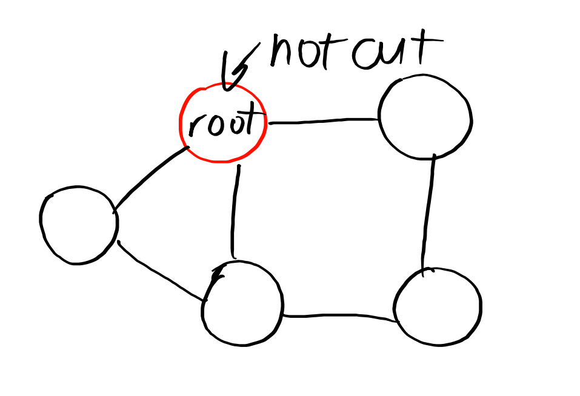
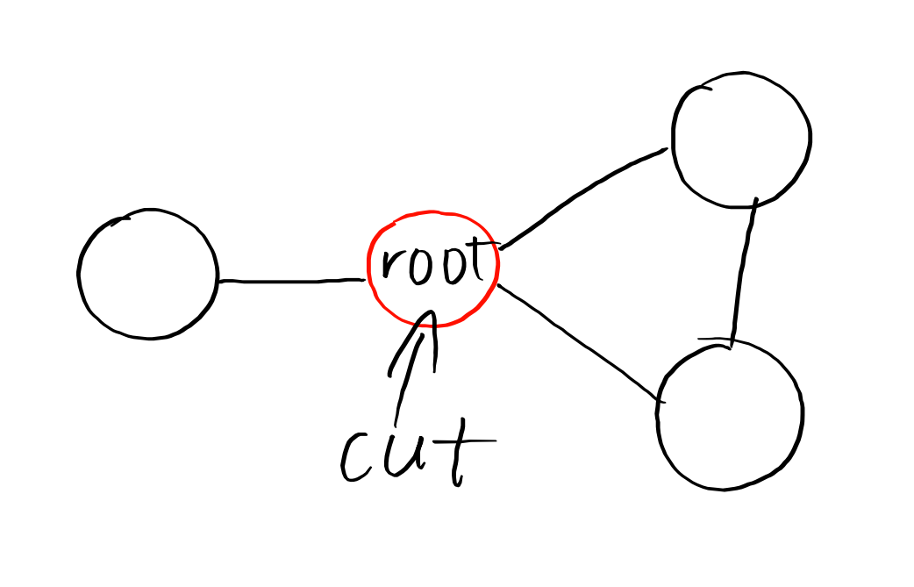

用这篇博客记录一下学习Tarjan缩点的风风雨雨

三种缩点的时间复杂度均为$\Large{O(n+m)}$

定义：
$\mathrm{dfn[x]}$时间戳：表示遍历到$x$之前遍历过多少个点
$\mathrm{low[x]}$追溯值：表示从$x$出发在不经过父子边的情况下能到达的最早的祖先的$\mathrm{dfn[x]}$值。

# 有向图

## 强联通分量缩点(SCC)

SCC的作用是将一个有向有环图的环缩成一个点，使其形成一个DAG，方便后续的运算。

### 伪代码
```
Tarjan(当前节点):
    //入
    初次进入当前节点 给当前节点赋新的 时间戳 和 追溯值
    将当前节点入栈
    //回
    遍历 当前节点的所有 孩子:
        如果 节点无时间戳(未被访问)：
            Tarjan(孩子)
            用 孩子的追溯值 更新 当前节点的追溯值
        如果 当前节点在栈中:
            用 孩子的时间戳 更新 当前节点的追溯值
    //离
    如果 当前节点的时间戳 等于 追溯值：(说明这里已经形成了一个强联通分量)
        弹栈(此时弹出来的都是强联通分量中的点) 直到 把当前节点弹出来
```

### Model Code
```cpp
#include<iostream>
#include<vector>
#include<queue>
using namespace std;
inline int read(){
	int x=0,f=1;char c=getchar();
	for(;!isdigit(c);c=getchar())if(c=='-')f=-1;
	for(;isdigit(c);c=getchar())x=(x<<3)+(x<<1)+(c^48);
	return x*f;
}
int n,m;
vector<int>po[200004];
deque<int>stk;
int dfn[200004],low[200004],tot=0,cnt=0;
bool instack[200004];
void Tarjan(int pos){
    //入
    dfn[pos]=low[pos]=++tot;
    stk.push_front(pos);
    instack[pos]=true;
    //回
    for(int to:po[pos]){
        if(!dfn[to]){
            Tarjan(to);
            low[pos]=min(low[pos],low[to]);
        }else if(instack[to]){
            low[pos]=min(low[pos],dfn[to]);
        }
    }
    //离
    if(dfn[pos]==low[pos]){
        int y;++cnt;
        do{
            y=stk.front();stk.pop_front();
            instack[y]=false;
        }while(y!=pos);
    }
}
int main(){
    n=read(),m=read();
    for(int i = 1,x,y;i<=m;i++){
        x=read(),y=read();
        po[x].push_back(y);
    }
    for(int i = 1;i<=n;i++){//可能图形不是联通的
        if(dfn[i])continue;
        Tarjan(i);
    }
    cout<<cnt;
}
```

# 无向图

无向图有两个缩点方式：点双 和 边双；

解释一下两者的区别：

||点双|边双|
|:--:|:--:|:--:|
|定义|在一张联通的无向图中，对于两个点$u$和$v$,如果无论删去哪个点($u$和$v$本身除外)，都不能使它们不联通，我们就说$u$和$v$**点双联通**|在一张联通的无向图中，对于两个点$u$和$v$,如果无论删去哪条边，都不能使它们不联通，我们就说$u$和$v$**边双联通**|
|性质|图中任意一个割点都在**至少两个**点双中<br>任意一个不是割点的点都只存在于**一个**点双中|割边不属于任意边双，而其它非割边的边都**属于且仅属于**一个边双。<br>对于一个边双中的任意两个点，它们之间都有**至少两条**边不重复的路径。|

## 点双联通分量缩点(v-DCC)

### 伪代码

```
int 根（当前进入时的根）
Tarjan(当前节点):
    初次进入当前节点 给当前节点赋新的 时间戳 和 追溯值
    将当前节点入栈
    如果 当前节点 等于 根 且 当前节点没有任何与它相连的边:（特判孤立点，因为如果不判无法进入下面的遍历，从而当前节点不会被作为点双联通分量）
        新建一个点双联通分量 并将当前节点 加入
        退出
    int 孩子数量
    遍历 当前节点的所有 孩子:
        如果 节点无时间戳(未被访问)：
            Tarjan(孩子)
            用 孩子的追溯值 更新 当前节点的追溯值
            如果 孩子的追溯值 比 当前节点的时间戳 要大:(假如儿子在不经过父子边的情况下不能到达当前节点的祖先，那么当前节点就是割点)
                孩子数量++（这是我的孩子）
                如果 当前节点不是根 或者 孩子数量大于1:
                    当前节点就是割点
                    //Q: 解释一下？
                    //A: 如果当前节点是 根，那么显然没有孩子能到他的祖先节点
                    //但是 如果是根并且孩子数量大于1，那么这个点依然能成为割点
                    //例子可以看下方的图
                新建一个点双
                弹栈 直到 把孩子弹出
                把当前节点加入点双
                //Q: 为什么不把当前节点弹掉？
                //A: 当前节点一定属于多个边双，若弹掉当前节点会导致其无法被加入其他点双
        否则:
            用 孩子的时间戳 更新 当前节点的 追溯值（假如走到了一个dfn更小的，那么更新low）

```


这个点不是割点，但没有孩子能走到他的祖先节点，若不特判将被判成割点



这个点是割点，因为它有两个孩子


### Model Code
```cpp
#include<iostream>
#include<vector>
#include<stack>
using namespace std;
inline int read(){
    int x=0,f=1;char c=getchar();
    for(;!isdigit(c);c=getchar())if(c=='-')f=-1;
    for(;isdigit(c);c=getchar())x=(x<<3)+(x<<1)+(c^48);
    return x*f;
}
vector<int>ro[2000005];
vector<int>dcc[2000005];
stack<int>stk;
int dfn[2000005],low[2000005],cut[2000005],id[2000005],tot=0,cnt=0,root;
bool instack[2000005];
inline void Tarjan(int pos){
	dfn[pos]=low[pos]=++tot;
    stk.push(pos);
    if(pos==root&&!ro[pos].size()){
        dcc[++cnt].push_back(pos);
        return;
    }
    int child = 0;
    for(int to:ro[pos]){
        if(!dfn[to]){
            Tarjan(to);
            low[pos]=min(low[pos],low[to]);
            if(low[to]>=dfn[pos]){
                child++;
                if(pos!=root||child>1)cut[pos]=true;
                cnt++;
                while(true){
                    int z = stk.top();stk.pop();
                    dcc[cnt].push_back(z);
                    if(z==to)break;
                }
                dcc[cnt].push_back(pos);
            }
        }else low[pos]=min(low[pos],dfn[to]);
    }
}
int main(){
    int n=read(),m=read();
    for(int i = 1,u,v;i<=m;i++){
        u=read(),v=read();
        if(u==v)continue; //这里记得判断u==v的情况，这种情况下不要加边，否则会出现自环
        ro[u].emplace_back(v);
        ro[v].emplace_back(u);
    }
    for (root=1;root<=n;root++) if (!dfn[root]) Tarjan(root);    cout<<cnt<<endl;
    for(int i = 1;i<=cnt;i++){
        cout<<dcc[i].size();
        for(int whi:dcc[i]){
            cout<<" "<<whi;
        }
        cout<<endl;
    }
    return 0;
}
```

## 边双联通分量缩点(e-DCC)


```
Tarjan(当前节点, 入边):
    初次进入当前节点 给当前节点赋新的 时间戳 和 追溯值
    将当前节点入栈
    遍历 当前节点的所有边:
        如果 节点无时间戳(未被访问)：
            Tarjan(边所指的孩子，当前边)
            用孩子的追溯值更新当前节点的追溯值
            如果 孩子的追溯值 大于 当前节点时间戳:(回不到当前节点了)
                当前边及其反边就是割边
        否则如果 当前边不是 入边的反边:(即 不回到当前节点的父亲)：
            用孩子节点的时间戳更新当前节点的追溯值（不通过父边可能能走到更早的祖先）
    如果 当前节点的时间戳 等于 当前节点的追溯值:(只能到自己)
        新建边双
        弹栈直到把自己弹掉
```

```cpp
#include<iostream>
#include<stack>
#include<vector>
using namespace std;
inline int read(){
    int x=0,f=1;char c=getchar();
    for(;!isdigit(c);c=getchar())if(c=='-')f=-1;
    for(;isdigit(c);c=getchar())x=(x<<3)+(x<<1)+(c^48);
    return x*f;
}
int n,m,tot,cnt,idx=1;
/* 
这里注意边的编号idx要从1开始
因为
对于奇数x, x^1=x+1
对于偶数x, x^1=x-1
方便找反边
 */
struct EDGE{/* 由于涉及到边的编号问题，使用前向星比较方便 */
    int v;
    int ne;
}edge[4000005];
int h[500005],dfn[4000005],low[4000005],bri[4000005];
vector<int>dcc[500005];
stack<int>stk;
void add(int a,int b){
    edge[++idx].v = b;
    edge[idx].ne = h[a];
    h[a]=idx;
}
void Tarjan(int pos,int in_edge){
    dfn[pos] = low[pos] = ++tot;
    stk.push(pos);
    for(int i = h[pos];i;i = edge[i].ne){
        int to = edge[i].v;
        if(!dfn[to]){
            Tarjan(to,i);
            low[pos] = min(low[pos],low[to]);
            if(low[to]>dfn[pos]) bri[i] = bri[i^1] = true;
        }else if(i != (in_edge^1))low[pos] = min(low[pos],dfn[to]);
    }
    if(dfn[pos]==low[pos]){
        ++cnt;
        while(true){
            int y = stk.top();stk.pop();
            dcc[cnt].push_back(y);
            if(y==pos)break;
        }
    }
}
int main(){
    n=read(),m=read();
    for(int i = 1,u,v;i<=m;i++){
        u=read(),v=read();
        add(u,v);add(v,u);
    }
    for(int i = 1;i<=n;i++) Tarjan(i,0);
    cout<<cnt<<endl;
    for(int i = 1;i<=cnt;i++){
        cout<<dcc[i].size();
        for(int node:dcc[i]){
            cout<<" "<<node;
        }
        cout<<endl;
    }
    return 0;
}
```

