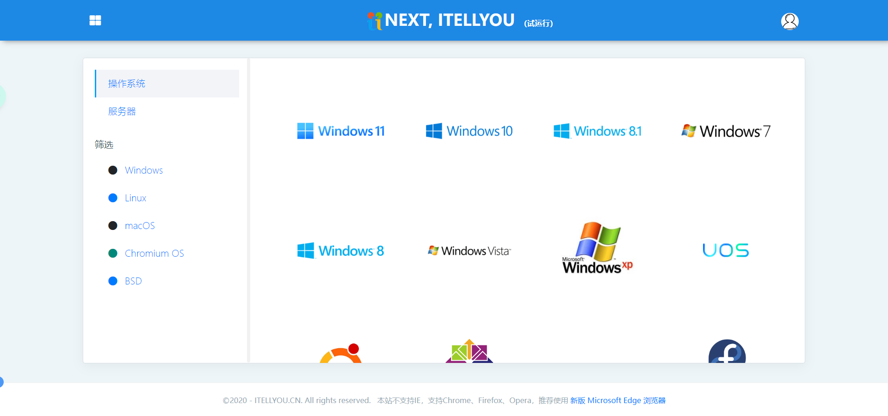
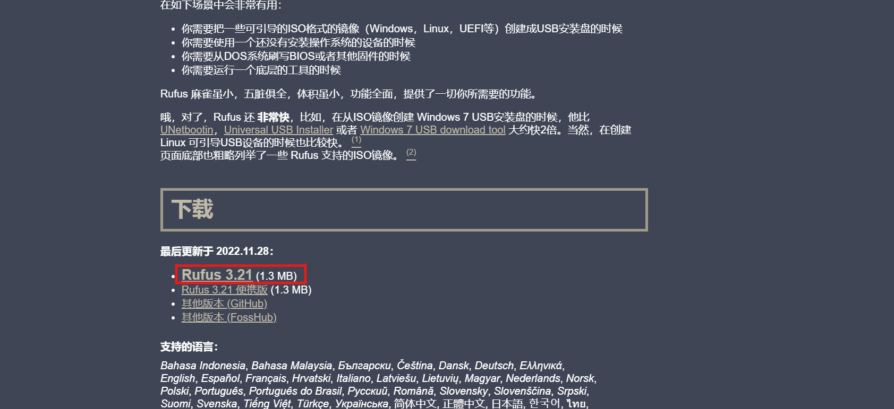
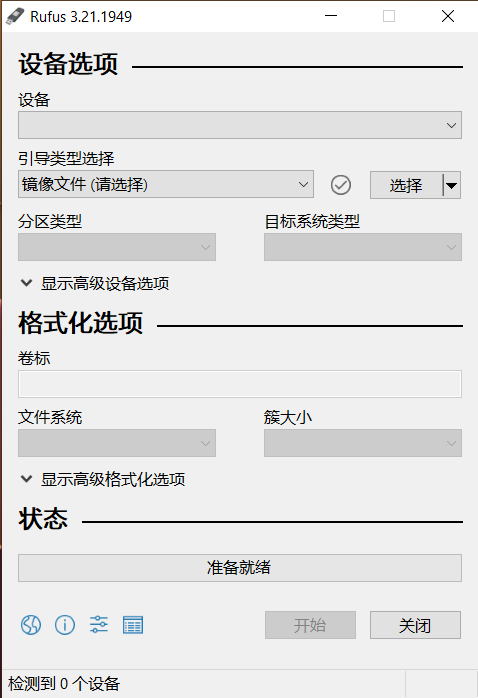

本教程将尽可能以最简练的方式向大家展示`Windows`系统的安装：

<!-- more -->

1. 确认安装方式
2. 确认安装体系
3. 下载系统
4. 下载驱动
5. 安装系统

## 确认安装方式
一般重装系统有三种方法：

- U盘/光盘 重装 (推荐，操作错误还能重新尝试) 
  - U盘制作启动盘进入PE重装（推荐，制作启动盘后以后将能一盘多用，例如维护，修复系统呀，系统崩溃后还原数据呀等等）
  - U盘烧录ISO镜像文件进行重装（比较推荐，简单，向导式重装，但是以后不能够用于维护系统） 
- 在当前系统下进行本地安装


## 确认安装体系

电脑系统安装体系有两种

|体系|对应硬盘格式|特点|
|:--:|:--:|:--:|
|$Legacy$|$MBR$|不能识别超过`3TB`的硬盘，启动速度较慢，只能有`3`个主分区|
|$UEFI$|$GPT$|较新的引导方法，能解决$Legacy$不能处理的问题，较旧的电脑可能不支持|

---

## 下载系统

### 下载

这里建议从👉[NEXT, ITELLYOU](https://next.itellyou.cn/)下载

<article class="message is-danger"><div class="message-body">
请不要下载`Ghost`系统镜像（如雨林木风、番茄花园、系统之家、装机员系统等）,会夹带私货，或系统不稳定
</div></article>

1. 注册账号或QQ登入
   
2. 选择系统，由于这篇教程安装`Windows`，请选择`Windows`系统  
   
   <article class="message is-warning"><div class="message-body">

   需要`BT`或`ED2K`下载器:推荐👉[迅雷](https://xl11.xunlei.com/)

   </div></article>

     

   <article class="message is-success"><div class="message-body">
   |系统|版本|包含|推荐指数|
   |:--:|:--:|:--:|:--:|
   |Windows11|商业版(business editions)|专业版、企业版、教育版、专业工作站版、专业教育版|⭐⭐⭐|
   |Windows11|零售版(consumer editions)|家庭版、专业版、教育版、家庭单语言版、专业工作站版、专业教育版|⭐⭐⭐|
   |Windows10|商业版(business editions)|专业版、企业版、教育版、专业工作站版、专业教育版|⭐⭐⭐⭐⭐|
   |Windows10|零售版(consumer editions)|家庭版、专业版、教育版、家庭单语言版、专业工作站版、专业教育版|⭐⭐⭐⭐|
   |Windows10|企业长期服务版(LTSC)|LTSC版|⭐⭐⭐⭐⭐|
   |Windows8.1, Windows8, Windows7, WindowsVista, WindowsXP|请前往👉[MSDN(旧站)](https://msdn.itellyou.cn/)下载|......|⭐⭐|
   </div></article>

### 校验系统

`NEXT, ITELLYOU`网站提供`MD5`校验值，请**务必**校验系统`MD5`值

- 方式1： 👉[校验工具](http://betteroier.tpddns.cn:8888/file/2/iHasher-v0.2.exe)
- 方式2：
  `Win`+`R`打开`cmd`,输入：
  ```input
  certutil -hashfile "改成你下载的系统镜像名" md5
  ```
  比如你的文件是`Mirror.iso`,位置在`D:\`,终端中输入
  ```input
  certutil -hashfile "D:\Mirror.iso" md5
  ```
  你得到
  ```output
  MD5 hash of D:\Mirror.iso:
  494c35ad437ba453fe9ac28193b4232d
  CertUtil: -hashfile command completed successfully.
  ```
  其中`494c35ad437ba453fe9ac28193b4232d`为该镜像的`MD5`值

<progress class="progress is-success is-small" max="40"></progress>

## 下载驱动

为防止某些电脑重装系统后出现网卡驱动未安装而无法进行下一步安装，进行系统安装前**务必**从当前主机的网卡的官网下载对应的**网卡驱动**  

硬件检测工具：👉[鲁大师绿色版](http://betteroier.tpddns.cn:8888/file/2/%E9%B2%81%E5%A4%A7%E5%B8%88.exe)

如果不放心，可以下载所有需要的驱动：显卡、声卡、主板。

<progress class="progress is-success is-small" max="40"></progress>

## 安装系统

### U盘制作启动盘安装 

<article class="message is-danger"><div class="message-body">
注意！你的U盘将会被格式化，请提前做好备份
</div></article>

使用👉[Rufus](http://rufus.ie/zh/)软件进行制作



打开软件：


插入你要制作启动盘的设备

选择你下载的镜像

分区类型填写你选择的安装体系对应的硬盘格式(`GPT`或`MBR`)  
目标系统类型将会自动填写  
文件系统选择`NTFS`

<article class="message is-danger"><div class="message-body">
你的U盘将会被格式化！！！请最后确认是否已备份！！！
</div></article>

准备好后点击`开始`
