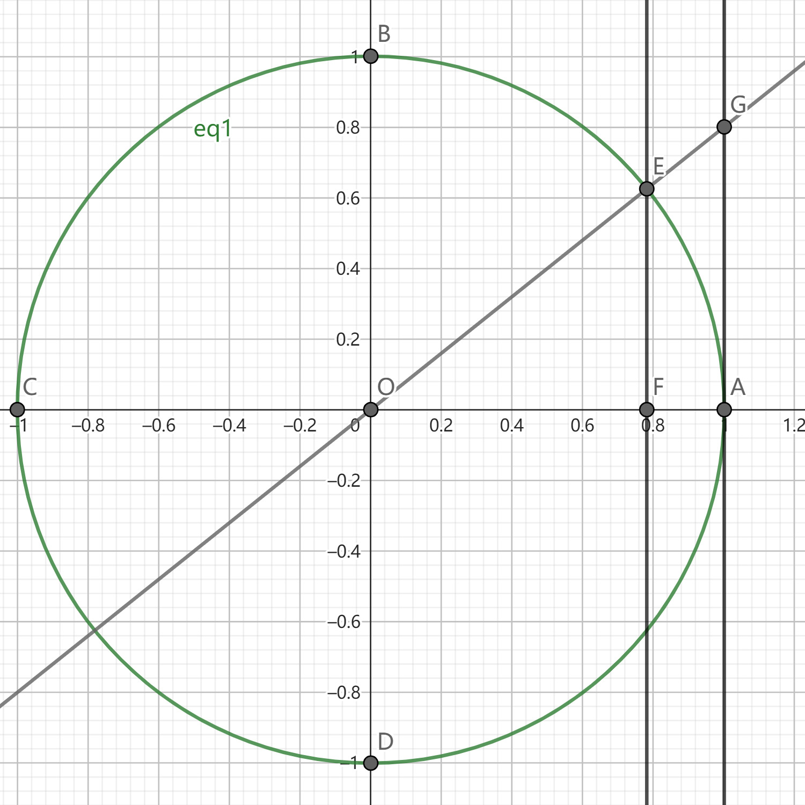

以下是对三角函数的一些整理
<!-- more -->

# 三角函数

## 同角三角函数关系
1. 平方关系：$\sin^2\alpha+\cos^2\alpha=1$
2. 商数关系：$\tan\alpha = \dfrac{\sin\alpha}{\cos\alpha}$

## 三角函数线

有向线段：
正弦线$EF$  
正切线$AG$  
余弦线$OF$  


特别的 当$\sin{x}<x<\tan{x},x\in\left(0,\dfrac{\pi}{2}\right)$时：
$\Rightarrow S_{\triangle OEF} < S_{\triangle\overset{\frown}{OAE}} < S_{\triangle OAG}$
$\Rightarrow EF<x<AG$


## 正弦函数

$f(x)=\sin x$
定义域：$R$
值域： $[-1,1]$
周期：$2\pi$
奇偶性：奇函数

## 余弦函数
$f(x)=\cos x$
定义域：$R$
值域： $[-1,1]$
周期：$2\pi$
奇偶性：偶函数

## 正切函数
$f(x)=\tan x$
定义域：$\{x|x\ne \dfrac{\pi}{2}+k\pi,k \in R\}$
值域： $R$
周期：$\pi$
奇偶性：奇函数

## 诱导公式

第一组


$\sin(2k\pi+\alpha)=\sin \alpha$  
$\cos(2k\pi+\alpha)=\cos \alpha$  
$\tan(2k\pi+\alpha)=\tan \alpha$  

$\sin(\pi+\alpha)=-\sin \alpha$  
$\cos(\pi+\alpha)=-\cos \alpha$  
$\tan(\pi+\alpha)=\tan \alpha$  

$\sin(2k\pi-\alpha)=-\sin \alpha$  
$\cos(2k\pi-\alpha)=\cos \alpha$  
$\tan(2k\pi-\alpha)=-\tan \alpha$  

$\sin(\pi-\alpha)=\sin \alpha$  
$\cos(\pi-\alpha)=-\cos \alpha$  
$\tan(\pi-\alpha)=-\tan \alpha$  



第二组：


$\sin(\dfrac{\pi}{2}-\alpha)= \cos \alpha$  
$\cos(\dfrac{\pi}{2}-\alpha)= \sin \alpha$  

$\sin(\dfrac{\pi}{2}+\alpha)= \cos \alpha$  
$\cos(\dfrac{\pi}{2}+\alpha)= -\sin \alpha$  

$\sin(\dfrac{3\pi}{2}-\alpha)= -\cos \alpha$  
$\cos(\dfrac{3\pi}{2}-\alpha)= -\sin \alpha$  

$\sin(\dfrac{3\pi}{2}+\alpha)= -\cos \alpha$  
$\cos(\dfrac{3\pi}{2}+\alpha)= \sin \alpha$  


## 两角和差

正弦：$\sin(\alpha\pm\beta)=\sin(\alpha)\cos(\beta)\pm\cos(\alpha)\sin(\beta)$  
余弦：$\cos(\alpha\pm\beta)=\cos(\alpha)\cos(\beta)\mp\sin(\alpha)\sin(\beta)$
正切：$\tan(\alpha\pm\beta)=\dfrac{\tan{\alpha}\pm\tan{\alpha}}{1\mp\tan{\alpha}\tan{\beta}}$

## 合一变形

将$a\sin x+b\cos x$合一变形
设 $\phi$：
$$\Rightarrow\begin{cases}\cos{\phi} = \dfrac{b}{\sqrt{a^2+b^2}}\\\sin{\phi} = \dfrac{a}{\sqrt{a^2+b^2}}\end{cases}$$
$$\begin{aligned}\Rightarrow a\sin x+b\cos x & = \sqrt{a^2+b^2}\left(\dfrac{a}{\sqrt{a^2+b^2}}\sin x+\dfrac{b}{\sqrt{a^2+b^2}}\cos x\right) \\ & = \sqrt{a^2+b^2}\cos(x-\phi)\end{aligned}$$

## 二倍角公式
$\sin{2\alpha}=2\sin{\alpha}\cos{\alpha}$  
$\begin{aligned} \cos{2\alpha} & =\cos^2\alpha-\sin^2\alpha\\ & = 2\cos^2\alpha-1\\ & = 1-2\sin^2\alpha\end{aligned}$  
$\tan 2\alpha = \dfrac{2\tan\alpha}{1-\tan^2\alpha}$  

## 半角公式
$\sin\dfrac{\alpha}{2} = \pm \sqrt{\dfrac{1-\cos\alpha}{2}}$  
$\cos\dfrac{\alpha}{2} = \pm \sqrt{\dfrac{1+\cos\alpha}{2}}$  
$\begin{aligned}\tan\dfrac{\alpha}{2} & = \dfrac{\sin\alpha}{1+\cos\alpha}\\ & = \dfrac{1-\cos\alpha}{\sin\alpha}\\ & = \pm \sqrt{\dfrac{1-\cos\alpha}{1+\cos\alpha}}\end{aligned}$

## 降次公式

$\sin{\alpha}\cos{\alpha} = \dfrac{1}{2}sin{2\alpha}$  
$\cos^2\alpha = \dfrac{1+\cos{2\alpha}}{2}$
$\sin^2\alpha = \dfrac{1-\cos{2\alpha}}{2}$

## 万能公式

$\sin\alpha = \dfrac{2\tan\dfrac{\alpha}{2}}{1+\tan^2\dfrac{\alpha}{2}}$
$\tan\alpha = \dfrac{2\tan\dfrac{\alpha}{2}}{1-\tan^2\dfrac{\alpha}{2}}$
$\cos\alpha = \dfrac{1-\tan^2\dfrac{\alpha}{2}}{1+\tan^2\dfrac{\alpha}{2}}$


## 三倍角公式

$\sin 3\alpha = 3\sin\alpha-4\sin^3\alpha$  
$\cos 3\alpha = -3\cos\alpha+4\cos^3\alpha$  
$\begin{aligned}\tan 3\alpha & = \dfrac{3\tan\alpha-\tan^3\alpha}{1-3\tan^2\alpha}\\ & = \tan\alpha\tan(\dfrac{\pi}{3}+\alpha)\tan(\dfrac{\pi}{3}-\alpha)\end{aligned}$  

## 积与和差

### 积化和差

$\sin\alpha\cos\beta = \dfrac{1}{2}\left[\sin(\alpha+\beta)+\sin(\alpha-\beta)\right]$
$\sin\alpha\sin\beta = -\dfrac{1}{2}\left[\cos(\alpha+\beta)-\cos(\alpha-\beta)\right]$
$\cos\alpha\cos\beta = \dfrac{1}{2}\left[\cos(\alpha+\beta)+\cos(\alpha-\beta)\right]$


### 和差化积

$\sin\alpha+\sin\beta = 2\sin\dfrac{\alpha+\beta}{2}\cos\dfrac{\alpha-\beta}{2}$
$\sin\alpha-\sin\beta = 2\cos\dfrac{\alpha+\beta}{2}\sin\dfrac{\alpha-\beta}{2}$
$\cos\alpha+\cos\beta = 2\cos\dfrac{\alpha+\beta}{2}\cos\dfrac{\alpha-\beta}{2}$
$\cos\alpha-\cos\beta = -2\sin\dfrac{\alpha+\beta}{2}\sin\dfrac{\alpha-\beta}{2}$


## 求三角函数最值？

1. $f(x) = a\sin{x}+b\cos{x}$，通过合一变形
2. $f(x) = a\sin^2x+b\sin{x}\cos{x}+\cos^2x$，通过先降次再合一
3. $f(x) = a\sin^2x+b\sin{x}+c$，通过二次合一

# 解三角形

## 余弦定理
$\boxed{SSA}\boxed{SAS}\begin{cases}c^2 = a^2+b^2-2ab\cos{C}\\b^2 = a^2+c^2-2ac\cos{B}\\a^2 = b^2+c^2-2bc\cos{A}\end{cases}$

$\boxed{SSS}\begin{cases}\cos{C} = \dfrac{a^2+b^2-c^2}{2ab}\\\cos{B} = \dfrac{a^2+c^2-b^2}{2ac}\\\cos{A} = \dfrac{b^2+c^2-a^2}{2bc}\\\end{cases}$

拓展：

假设$\angle{C}>\angle{B}>\angle{A}$：
若$\angle{C}=90^\circ\Longleftrightarrow\cos{C}=0\Longleftrightarrow a^2+b^2=c^2$  
若$\angle{C}<90^\circ\Longleftrightarrow\cos{C}>0\Longleftrightarrow a^2+b^2>c^2$  
若$\angle{C}>90^\circ\Longleftrightarrow\cos{C}<0\Longleftrightarrow a^2+b^2<c^2$



## 正弦定理

$\boxed{AAS}\boxed{ASA} \dfrac{a}{\sin{A}}=\dfrac{b}{\sin{B}}=\dfrac{c}{\sin{C}}=D=2R$
$\begin{cases}
  \sin{A}=\dfrac{a}{2R}\\
  a = 2R\sin{A}
\end{cases}$
在$\triangle{ABC}$中，$A>B\Longleftrightarrow a>b\Longleftrightarrow \sin{A}>\sin{B}$

## 已知$\boxed{SSA}?$
1. 利用余弦公式$\Longrightarrow$方程正根
2. 利用正弦定理$\Longrightarrow\dfrac{a}{\sin A}=\dfrac{b}{\sin B}$
   $0<\sin B< 1\Longrightarrow 有两解 \Longrightarrow 保证C \in (0^\circ, 180^\circ)$
   $\sin B= 1\Longrightarrow 一解  B=90^\circ$
   $\sin B> 1\Longrightarrow 无解$

## $\triangle{ABC}面积$

$\begin{aligned}S_{\triangle{ABC}} & =\dfrac{1}{2}bc\sin{A}\\ & = \dfrac{1}{2}\left|\overrightarrow{AB}\right|\left|\overrightarrow{AC}\right|\sqrt{1-\cos^2A}\end{aligned}$

## $\triangle{ABC}形状$

1. $a\cos B = b\cos A$ 等腰
2. $A\cos B = b\cos B$ 等腰直角
3. $\color{RED}{公式遗漏，待询问}$

