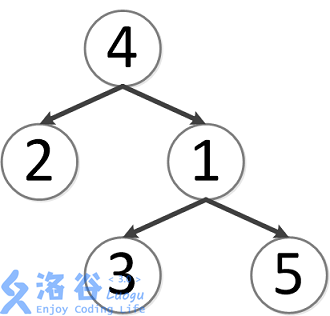

## 题目描述

如题，给定一棵有根多叉树，请求出指定两个点直接最近的公共祖先。

<!-- more -->

## 输入格式

第一行包含三个正整数 $N,M,S$，分别表示树的结点个数、询问的个数和树根结点的序号。

接下来 $N-1$ 行每行包含两个正整数 $x, y$，表示 $x$ 结点和 $y$ 结点之间有一条直接连接的边（数据保证可以构成树）。

接下来 $M$ 行每行包含两个正整数 $a, b$，表示询问 $a$ 结点和 $b$ 结点的最近公共祖先。

## 输出格式

输出包含 $M$ 行，每行包含一个正整数，依次为每一个询问的结果。

## 样例 #1

### 样例输入 #1

```
5 5 4
3 1
2 4
5 1
1 4
2 4
3 2
3 5
1 2
4 5
```

### 样例输出 #1

```
4
4
1
4
4
```

## 提示

对于 $30\%$ 的数据，$N\leq 10$，$M\leq 10$。

对于 $70\%$ 的数据，$N\leq 10000$，$M\leq 10000$。

对于 $100\%$ 的数据，$N\leq 500000$，$M\leq 500000$。


样例说明：

该树结构如下：

  

第一次询问：$2, 4$ 的最近公共祖先，故为 $4$。

第二次询问：$3, 2$ 的最近公共祖先，故为 $4$。

第三次询问：$3, 5$ 的最近公共祖先，故为 $1$。

第四次询问：$1, 2$ 的最近公共祖先，故为 $4$。

第五次询问：$4, 5$ 的最近公共祖先，故为 $4$。

故输出依次为 $4, 4, 1, 4, 4$。

<div class="tabs is-toggle"><ul>
<li class="is-active"><a onclick="onTabClick(event)">
<span>算法分析</span>
</a></li>
<li><a onclick="onTabClick(event)">
<span>模板</span>
</a></li>
</ul></div>

<div id="算法分析" class="tab-content" style="display: block;">

此算法需要两次$DFS$

第一次$DFS$完成找重儿子$son[]$,子树大小$size[]$,深度$depth[]$,父子关系$fa[]$的任务  
我们不妨令1号结点为树根,进行$DFS$,即可完成
```cpp
void dfs_1(int u,int f){
    fa[u]=f,size[u]=1;
    depth[u]=depth[f]+1;
    int t=-1;
    for(int i = 0;i<ro[u].size();i++){
        if(ro[u][i]==f) continue;
        dfs_1(ro[u][i],u);
        size[u]+=size[ro[u][i]];
        if(size[ro[u][i]]>t){
            t=size[ro[u][i]],son[u]=ro[u][i];
        }
    }
}
```
第二次$DFS$,则要处理出每个点其重链所在的链头,以及$DFS$序通过代码及图示可以发现重链剖分的一此性质:
通过代码及图示可以发现重链剖分的一些性质:

1. 所有重链互不相交,即每个点只属于一条重链
2. 所有重链长度和等于节点数(链长指链上节点数)
3. 一个点到根节点的路径上经过的边中轻边最多只有log条

前两个性质好理解,那么第三个性质是为什么呢?因为最坏情况就是这个点到根路径上经过的边都是轻边,  
那么每走一条轻边到达这个点的父节点就代表这个父节点至少还有一个与当前子树同样大的子树,也就是说每走一条轻边走到的点的子树  
大小就要*2,因此最多只能走$log$次。这也是为什么要选重儿子而不是随便一个儿子的原因。

```cpp
void dfs_2(int u,int f){
    top[u]=f;
    id[u]=++cnt;
    w[cnt]=b[u];
    if(!son[u]) return;
    dfs_2(son[u],f);
    for(int i = 0;i<ro[u].size();i++){
        if(ro[u][i]==fa[u]||ro[u][i]==son[u])continue;
        dfs_2(ro[u][i],ro[u][i]);
    }
}
```

对于求$x,y$的$LCA$,可以每次优先爬点所在重链链头深的点,如果两个点不在同一条重链上,那么直接把链头深的点跳到链头,  
重复这个过程,直到两个点处在同一条重链上,直接输出深度浅的点就是$LCA$了。  
因为重链是直接跳到链头,时间复杂度是$O(1)$的,而跳轻边最多就$log$条,因此,
求两个点的$LCA$时间复杂度是$O(\log n)$

```cpp
int LCA(int x,int y){
    while(top[x]!=top[y]){
        if(depth[top[x]]<depth[top[y]]) swap(x,y);
        x=fa[top[x]];
    }return depth[x]<depth[y]? x:y;
}
```

</div>

<div id="模板" class="tab-content">
```cpp

#include<bits/stdc++.h>
using namespace std;
const int MAXN = 1e6+5;
inline int read(){
	int x=0,f=1;char c=getchar();
	for(;!isdigit(c);c=getchar())if(c=='-')f=-1;
	for(;isdigit(c);c=getchar())x=(x<<3)+(x<<1)+(c^48);
	return x*f;
}
vector <int> ro[MAXN];
int cnt,fa[MAXN],size[MAXN],depth[MAXN],son[MAXN],top[MAXN],id[MAXN],w[MAXN],b[MAXN];
void dfs_1(int u,int f){
    fa[u]=f,size[u]=1;
    depth[u]=depth[f]+1;
    int t=-1;
    for(int i = 0;i<ro[u].size();i++){
        if(ro[u][i]==f) continue;
        dfs_1(ro[u][i],u);
        size[u]+=size[ro[u][i]];
        if(size[ro[u][i]]>t){
            t=size[ro[u][i]],son[u]=ro[u][i];
        }
    }
}
void dfs_2(int u,int f){
    top[u]=f;
    id[u]=++cnt;
    w[cnt]=b[u];
    if(!son[u]) return;
    dfs_2(son[u],f);
    for(int i = 0;i<ro[u].size();i++){
        if(ro[u][i]==fa[u]||ro[u][i]==son[u])continue;
        dfs_2(ro[u][i],ro[u][i]);
    }
}
int LCA(int x,int y){
    while(top[x]!=top[y]){
        if(depth[top[x]]<depth[top[y]]) swap(x,y);
        x=fa[top[x]];
    }return depth[x]<depth[y]? x:y;
}
int main(){
    int N=read(),M=read(),S=read(),u,v;
    N--;
    for(;N--;){
        cin>>u>>v;
        ro[u].push_back(v);
        ro[v].push_back(u);
    }
    dfs_1(S,0);
    dfs_2(S,S);
    for(;M--;){
        cin>>u>>v;
        cout<<LCA(u,v)<<endl;
    }
    return 0;
}
```
</div>


<style type="text/css">
.content .tabs ul { margin: 0; }
.tab-content { display: none; }
</style>

<script>
function onTabClick (event) {
    var tabTitle = $(event.currentTarget).children('span:last-child').text();
    $('.article .content .tab-content').css('display', 'none');
    $('.article .content .tabs li').removeClass('is-active');
    $('#' + tabTitle).css('display', 'block');
    $(event.currentTarget).parent().addClass('is-active');
}
</script>
