## 题目描述

给定两个整型数组$A,B$，长度分别为$n,m$，且均为单调不下降序列。给定整数$k$，求出第$k$小值。

## 输入格式

第一行三个整数，分别表示$n,m,k$;
第二行$n$个整数，表示数组$A_i$;
第二行$m$个整数，表示数组$B_i$.

## 输出格式

一个整数表示第$k$小值.

## 样例

```input1
4 6 8
1 3 6 7
0 2 4 5 9 11
```

```output1
7
```

## 提示

$1 \leq n,m \leq 10^7,1 \leq k \leq m+n, 0 \leq A_i,B_i<2^{64}-1$


## Sol.1 双指针扫描

时间复杂度$O(n)$

不赘述

## Sol.2 中位数BFPRT

时间复杂度$O(\log n)$

### BFPRT 求有序数组中位数

可以通过递归求解计算，时间复杂度$O(\log n)$

比如，我们有如下长度为$10$(偶数)的两个有序数组$a,b$：

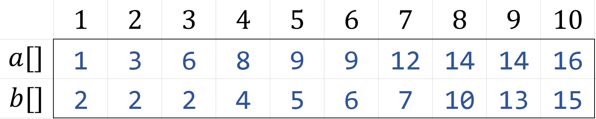

我们取每个数组中位数进行比较

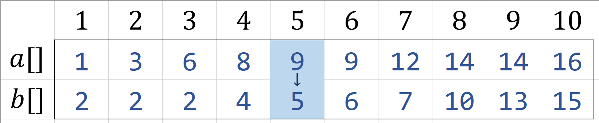

若$A[mid]>B[mid]$,那么，显然中位数不会出现在标黄色区域

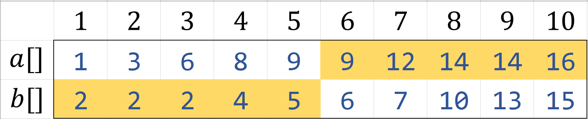

那么我们只需要在蓝色区间内查找中位数

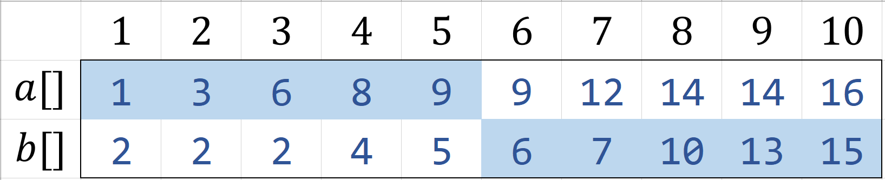

此时我们有如下长度为$5$(奇数)的两个有序数组$a,b$：

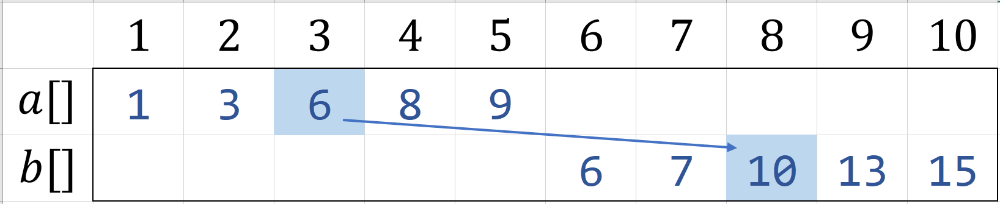

若$A[mid]<B[mid]$,那么，显然中位数不会出现在标黄色区域

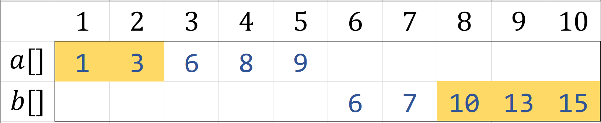

但是当我们去掉不可能的部分后，剩下的部分长度不等

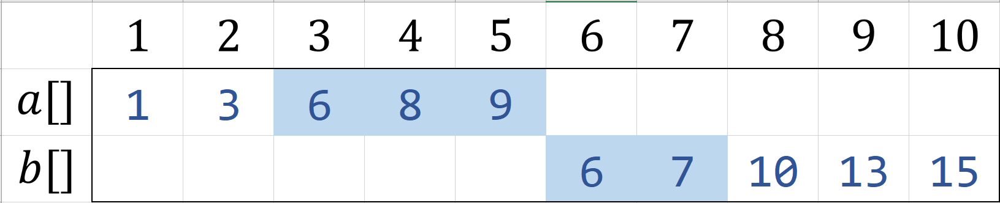

此时我们可以把$A[mid]$与$B[mid-1]$比较

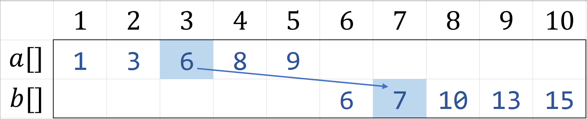

若$A[mid] \geq B[mid-1]$那么可以断定$A[mid]$就是中位数

若$A[mid] < B[mid-1]$ ,那么继续递归转到下一次寻找中位数

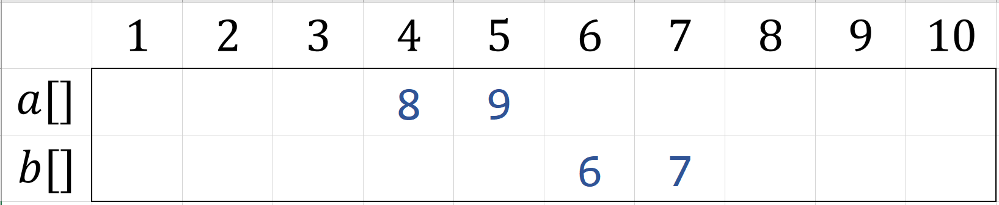

直到最后每个数组只剩$1$个数，返回其中较小值即可

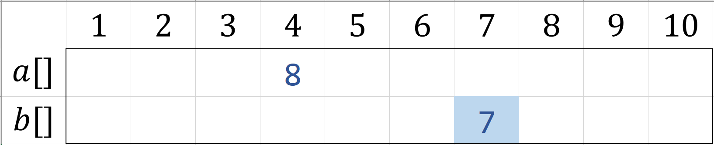

在本例中，中位数为$7$.

若上述某一步奇偶性或大小表示不同，那么相反操作即可

```cpp
int dfs(int sa,int ea,int sb,int eb){
    if(sa==ea)return min(a[sa],b[sb]);//终止条件
    int ma=(sa+ea)>>1,mb=(sb+eb)>>1; //数组a,b的中间位置
    bool ji=(ea-sa+1)&1; //判断奇偶
    if(a[ma]>b[mb]){
        if(ji){
            if(b[mb]>=a[ma-1]) return b[mb];
            else return dfs(sa,ma-1,mb+1,eb);
        }else return dfs(sa,ma,mb+1,eb);
    }else{
        if(ji){
            if(a[ma]>=b[mb-1]) return a[ma];
            else return dfs(ma+1,ea,sb,mb-1);
        }else return dfs(ma+1,ea,sb,mb);
    }
}
```

### 利用BFPRT求第K小值

如给定如下有序数组$a,b$

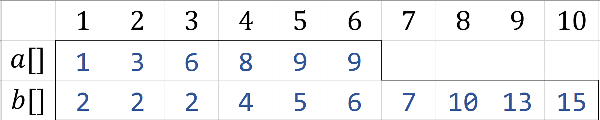

长度分别为$n=6,m=10$

对于给定的$K$，分三种讨论

1. $K \leq \min(n,m)$
2. $\min(n,m) \leq K \leq \max(n,m)$
3. $\max(n,m) \leq K$

---

对于第一种，若$K=4$，我们只需要对$a[1 \to K],b[1 \to K]$进行求中位数即可 

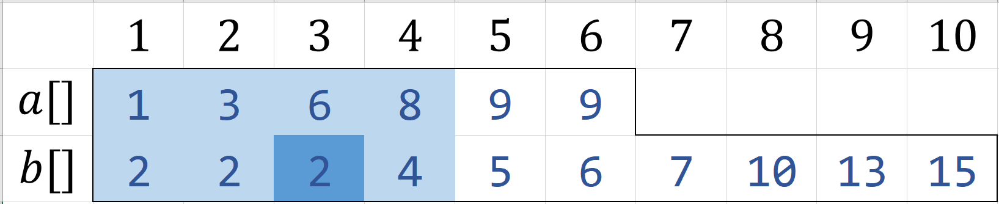

即$2$

```cpp
int solve1(){
    return dfs(1,k,1,k);
}
```

---

对于第二种，若$K=8$

因为在本例中$n<m$,我们需要对$b[K-n]$特判(若$n>m$则交换$a,b$)

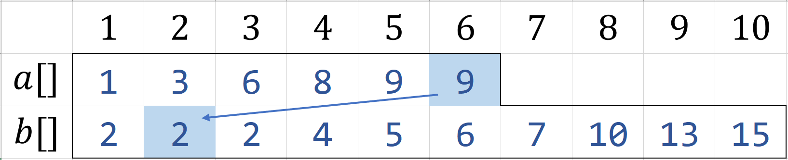

若$b[K-n] \geq a[n]$,那么$b[K-n]$就是第$K$小值

若$b[K-n] < a[n]$,那么对$a[1 \to n],b[K-n+1 \to K]$进行求中位数即可

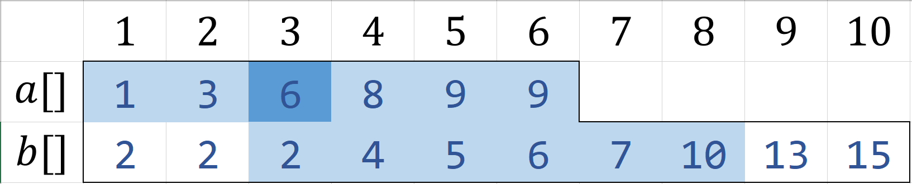

即$6$

```cpp
int solve2(){
    if(n<m){
        if(b[k-n]>=a[n]) return b[k-n];
        else return dfs(1,n,k+1-n,k);
    }else{
        if(a[k-m]>=b[m]) return a[k-m];
        else return dfs(k+1-m,k,1,m);
    }
}
```

---

对于第三种，若$K=12$

我们需要对$b[K-n]，a[K-m]$特判

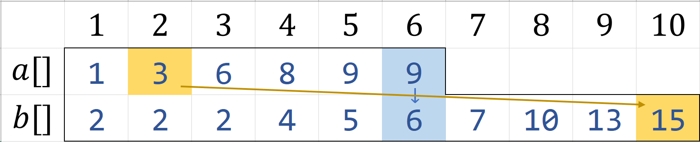

若$b[K-n] \geq a[n]$,那么$b[K-n]$就是第$K$小值

若$a[K-m] \geq b[n]$,那么$a[K-m]$就是第$K$小值

若$b[K-n] < a[n] \And a[K-m] < b[n]$,那么对$a[K-m+1 \to n],b[K-n+1 \to m]$进行求中位数即可

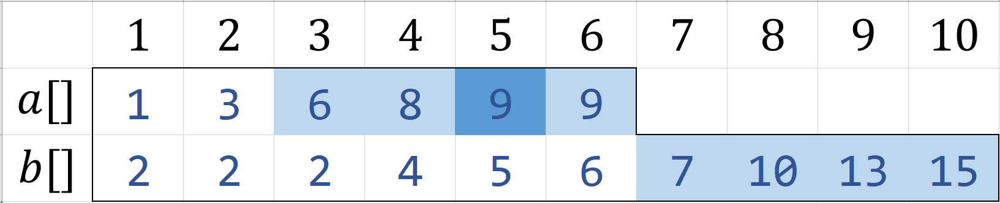

即$9$

```cpp
int solve3(){
    if(a[k-m]>=b[m]) return a[k-m];
    else if(b[k-n]>=a[n]) return b[k-n];
    else return dfs(k+1-m,n,k+1-n,m);
}
```

---

总体时间复杂度全部在BFPRT求中位数上，复杂度为$O(\log n)$

### Code
```cpp
#include<iostream>
#define min(x,y) ((x)>(y)?(y):(x))
#define max(x,y) ((x)<(y)?(y):(x))
using namespace std;
inline long long read(){
	long long x=0,f=1;char c=getchar();
	for(;!isdigit(c);c=getchar())if(c=='-')f=-1;
	for(;isdigit(c);c=getchar())x=(x<<3)+(x<<1)+(c^48);
	return x*f;
}
long long n,m,k,a[10000005],b[10000005];
long long dfs(long long sa,long long ea,long long sb,long long eb){
    if(sa==ea)return min(a[sa],b[sb]);
    long long ma=(sa+ea)>>1,mb=(sb+eb)>>1;
    bool ji=(ea-sa+1)&1;
    if(a[ma]>b[mb]){
        if(ji){
            if(b[mb]>=a[ma-1]){
                return b[mb];
            }else{
                return dfs(sa,ma-1,mb+1,eb);
            }
        }else{
            return dfs(sa,ma,mb+1,eb);
        }
    }else{
        if(ji){
            if(a[ma]>=b[mb-1]){
                return a[ma];
            }else{
                return dfs(ma+1,ea,sb,mb-1);
            }
        }else{
            return dfs(ma+1,ea,sb,mb);
        }
    }
}
void solve1(){
    cout<<dfs(1,k,1,k);
}
void solve2(){
    if(n<m){
        if(b[k-n]>=a[n]) cout<<b[k-n];
        else cout<<dfs(1,n,k+1-n,k);
    }else{
        if(a[k-m]>=b[m]) cout<<a[k-m];
        else cout<<dfs(k+1-m,k,1,m);
    }
}
void solve3(){
    if(a[k-m]>=b[m]) cout<<a[k-m];
    else if(b[k-n]>=a[n]) cout<<b[k-n];
    else cout<<dfs(k+1-m,n,k+1-n,m);
}
int main(){
    n=read(),m=read(),k=read();
    for(long long i = 1;i<=n;i++) a[i]=read();
    for(long long i = 1;i<=m;i++) b[i]=read();
    long long minn=min(n,m),maxn=max(n,m);
    if(k<=minn) solve1();
    else if(k>minn && k<=maxn) solve2();
    else solve3();
}
```
